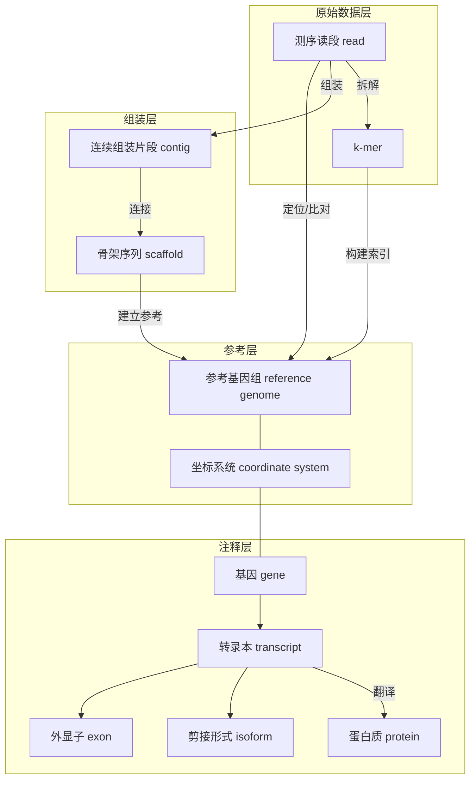

## 是什么

术语表不是把英文名词简单翻成中文，而是帮助读者快速确认：当前页面讨论的到底是哪一层对象、哪一类算法、哪一种文件或流程概念。对 wiki 来说，它承担的是统一术语和减少跨页歧义的作用。

## 为什么重要

生物信息学里很多混乱并不是来自公式本身，而是来自术语层级混用，例如：

- 把 gene、transcript、protein 混成一个对象；
- 把 alignment、mapping、assembly 当成同一类任务；
- 把 reference version、annotation version、database record 混为一谈。

因此，术语表的目标不是求全，而是优先覆盖高频、易混淆、会跨板块反复出现的词。

## 核心术语

### 生物信息学对象层级关系

为了直观理解这些核心术语之间的空间与逻辑关系，可以参考下图：

- **测序读段（read）**：测序仪直接产生的原始序列片段。
- **参考基因组（reference genome）**：作为比对、变异检测和注释解释的参考序列背景。
- **注释（annotation）**：描述基因（gene）、转录本（transcript）、外显子（exon）、编码区（CDS, Coding Sequence）等特征（feature）的位置与属性。
- **比对（alignment）**：将序列与参考序列或另一条序列建立字符级对应关系。
- **定位（mapping）**：强调将读段（reads）定位到参考序列的候选位置，未必建立完整字符级对应。
- **组装（assembly）**：在无完整参考或不依赖参考的情况下，将读段重建成更长序列。
- **连续组装片段（contig）**：由重叠或图路径拼接而成的连续序列。
- **骨架序列（scaffold）**：在连续组装片段（contig）基础上，利用配对信息、长读长或其他证据连接得到的更长序列。
- **覆盖度（coverage）**：某段序列被读段覆盖的深度或广度。
- **k-mer**：长度为 k 的子串，是索引、计数、组装图和伪比对（pseudo-alignment）的常见基本单位。
- **序列模式（motif）**：具有生物学意义、可在多条序列中重复出现的局部模式。
- **变异（variant）**：样本序列相对参考序列的差异，如单核苷酸变异（SNV, Single Nucleotide Variant）、插入缺失（indel）或结构变异。
- **基因（gene）**：功能或调控层的基本单位之一，但不等同于某一条具体转录本（transcript）。
- **转录本（transcript）**：基因表达后形成的 RNA 产物层对象，可能存在多个可变剪接形式（isoform）。
- **可变剪接形式（isoform）**：同一基因产生的不同转录本形式，常因可变剪接或不同转录起始/终止位点而产生。
- **蛋白质（protein）**：基因/转录本下游的功能产物层对象。
- **坐标系统（coordinate system）**：序列区间的编号方式、边界定义及链方向的解释规则。
- **多重比对（multi-mapping）**：一个读段可兼容多个参考位置或多个转录本的情况。
- **Burrows–Wheeler 变换（Burrows–Wheeler Transform, BWT）**：压缩索引与快速搜索的核心构件之一。
- **FM-index**：建立在 Burrows–Wheeler 变换之上的压缩全文索引结构，可高效支持序列搜索。
- **隐马尔可夫模型（Hidden Markov Model, HMM）**：用于建模隐藏状态与观测序列之间概率关系的概率图模型。
- **谱隐马尔可夫模型（profile HMM）**：面向序列家族建模的 HMM，常用于蛋白家族与保守区域识别。

## 应用场景

术语表最适合在以下时候快速回查：

- 从基础页跳到算法页时，确认对象层是否变化；
- 从 workflow 页跳到数据库或格式页时，确认读到的是数据对象、文件格式还是资源入口；
- 阅读 RNA-seq、variant calling、assembly 等页面时，避免把不同层次的“结果”混在一起理解。

## 常见误区

- 觉得术语表只是词典，因此不关心对象层级；
- 只记中文翻译，不关心英文术语在工具、论文和数据库中的具体含义；
- 在一篇文章里混用多个译法，导致跨页检索困难；
- 把流程名、对象名、文件格式名和算法名混在一起使用。

## 参考资料

- [写作规范](../intro/style-guide.md)
- 《An Introduction to Bioinformatics Algorithms》
- NCBI、Ensembl、UniProt 等官方文档

## 相关页面

- [生物信息学中的基础对象](../foundations/biology-basics.md)
- [序列、字符串与坐标系统](../foundations/sequences-and-strings.md)
- [参考基因组与注释](../foundations/reference-and-annotation.md)
- [常见数据格式总览](../formats/common-file-formats.mdx)
- [数据库与注释系统一览](../data-references/databases-and-annotations.mdx)
