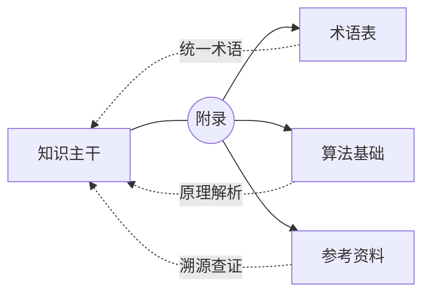

import SectionNavigator from '@/components/docs/SectionNavigator.astro';

附录承担的是 wiki 的查阅、收束和补充功能：当主线内容逐渐变多时，术语、参考资料和后续索引型页面需要有一个稳定归宿。

## 这一部分在全站中的位置

它不是知识主干的一部分，而是帮助读者在主干之外快速查词、追溯来源和整理后续补充内容的区域。

## 子主题导航

<SectionNavigator
  items={[
    {
      title: '术语表',
      to: '/docs/appendix/glossary',
      description: '集中维护关键术语的中英文对应和简明解释。',
    },
    {
      title: '算法基础',
      to: '/docs/appendix/algorithms',
      description: '系统梳理生物信息学核心算法类别、复杂度分析与设计原则。',
    },
    {
      title: '参考资料',
      to: '/docs/appendix/references',
      description: '整理教材、综述、经典论文与可信数据库入口。',
    },
  ]}
/>
