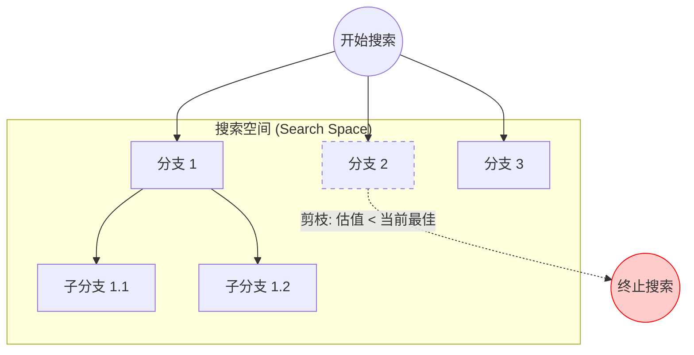
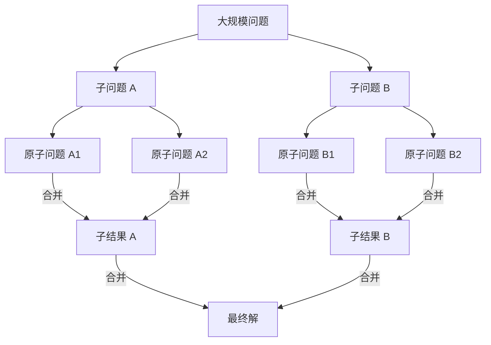

import PageHeaderMeta from '@/components/docs/PageHeaderMeta.astro';
import PrerequisitesBox from '@/components/docs/PrerequisitesBox.astro';
import SummaryBox from '@/components/docs/SummaryBox.astro';
import RelatedLinks from '@/components/docs/RelatedLinks.astro';

<PageHeaderMeta
  section="Core Methods"
  estimatedTime="25 分钟"
  difficulty="基础"
/>

# 算法设计范式

面对生物信息学中的复杂计算问题——从在海量序列中搜索模式，到重建基因组，再到识别隐藏的信号——一个核心问题是：**如何选择合适的算法策略来高效求解？**

生物信息学算法可以归纳为六种核心的设计范式。理解这些范式不仅能帮助你理解现有工具的工作原理，更能培养将生物学问题转化为计算问题的系统性思维能力。

## 核心问题

不同算法设计范式适用于不同类型的问题：

- **穷举搜索**：当解空间有限且需要精确解时
- **贪心算法**：当局部最优选择能导向满意的全局解时
- **动态规划**：当问题具有重叠子问题和最优子结构时
- **分治算法**：当问题可分解为相互独立的子问题时
- **图算法**：当问题可建模为顶点-边关系时
- **随机化算法**：当搜索空间巨大且近似解可接受时

<PrerequisitesBox>
- 已理解基础算法概念（循环、递归、数组）
- 了解生物信息学中的基本对象（序列、基因组、reads）
- 推荐阅读：[算法与复杂度](../foundations/algorithms-and-complexity.md)
</PrerequisitesBox>

## 六种核心范式

| 范式 | 核心思想 | 典型应用 | 复杂度特征 |
|------|---------|---------|-----------|
| **穷举搜索** | 遍历所有可能解 | 限制图谱、基序发现 | 指数级，需剪枝优化 |
| **贪心算法** | 局部最优选择 | 基因组重排、Motif搜索 | 多项式，但可能非全局最优 |
| **动态规划** | 子问题复用 | 序列比对、基因预测 | 多项式，空间换时间 |
| **分治算法** | 分解-解决-合并 | 排序、序列比对 | 常带来对数级优化 |
| **图算法** | 顶点-边建模 | 组装、系统发育 | 依赖图结构特性 |
| **随机化算法** | 随机采样探索 | Motif发现、大数据搜索 | 期望多项式，近似解 |

---

## 1. 穷举搜索（Exhaustive Search）

### 核心思想

当问题的解空间是有限的、可枚举的，且规模不大时，最直接的方法就是**尝试所有可能性**。

### 视觉化直觉：分支定界



```text
BRUTEFORCEMOTIFSEARCH(DNA, t, n, l)
1 bestMotif ← (1, 1, ..., 1)
2 s ← (1, 1, ..., 1)                    // t 个序列的起始位置
3 while forever
4     if Score(s) > Score(bestMotif)
5         bestMotif ← s
6     if all s[i] == n - l + 1
7         return bestMotif
8     s ← NextLeaf(s)                   // 枚举下一个位置组合
```

### 生物信息学实例

| 问题 | 搜索空间 | 优化策略 |
|------|---------|---------|
| **限制图谱**（Restriction Mapping） | 所有点对距离的多重集组合 | 分支定界剪枝 |
| **基序发现**（Motif Finding） | (n-l+1)^t 个位置组合 | 中值字符串、模式驱动 |
| **Median String** | 4^l 个可能的字符串 | 分支定界 |

### 关键洞察

穷举搜索的问题往往不是"能不能做"，而是"如何在合理时间内完成"。**分支定界**（Branch and Bound）是最常用的优化策略：

```
核心思想：如果当前部分解的最优可能值 ≤ 已找到的最佳解，
         则剪掉这个分支，不再深入搜索。
```

---

## 2. 贪心算法（Greedy Algorithms）

### 核心思想

每一步都做出**局部最优**选择，期望累积成全局最优解。

### 经典案例：反转排序（Sorting by Reversals）

基因组重排问题：给定两个基因排列，求最短的反转序列将一个变为另一个。

### 视觉化直觉：贪心选择


```text
SIMPLEREVERSALSORT(π)
1 for i ← 1 to n - 1
2     j ← position of element i in π
3     if j ≠ i
4         π ← π · ρ(i, j)              // 反转区间 [i,j]
5         output π
6     if π is the identity permutation
7         return
```

**贪心策略**：每一步都把第 i 个元素放到第 i 个位置。

### 贪心 vs 最优

| 场景 | 贪心结果 | 最优结果 |
|------|---------|---------|
| 612345 → | 5步 | 2步（612345 → 543216 → 123456） |

这说明**贪心不一定最优**，但通常高效且近似比可接受。

### 生物信息学中的贪心应用

- **基因组重排**：断点贪心（Breakpoint Reversal Sort）
- **Motif 搜索**：贪心谱搜索（Greedy Profile Motif Search）
- **层次聚类**：每次合并距离最近的两个聚类

---

## 3. 动态规划（Dynamic Programming）

### 核心思想

**重叠子问题** + **最优子结构**：大问题分解为重叠的小问题，存储子问题的解避免重复计算。

### 曼哈顿游客问题（Manhattan Tourist Problem）

在加权网格中寻找从起点到终点的最长路径：

### 视觉化直觉：子问题重叠与网格路径

```mermaid
grid-layout
    [ (0,0) ] -- 1 --> [ (0,1) ] -- 3 --> [ (0,2) ]
      |                |                |
      2                4                1
      v                v                v
    [ (1,0) ] -- 2 --> [ (1,1) ] -- 5 --> [ (1,2) ]
      |                |                |
      3                1                2
      v                v                v
    [ (2,0) ] -- 4 --> [ (2,1) ] -- 1 --> [ (2,2) ]
```

*注：动态规划通过填充得分矩阵，利用 $s[i,j] = \max(s[i-1,j] + \text{down}, s[i,j-1] + \text{right})$ 递推求解。*

```text
MANHATTANTOURIST(n, m, down, right)
1 s[0, 0] ← 0
2 for i ← 1 to n
3     s[i, 0] ← s[i-1, 0] + down[i, 0]
4 for j ← 1 to m
5     s[0, j] ← s[0, j-1] + right[0, j]
6 for i ← 1 to n
7     for j ← 1 to m
8         s[i, j] ← max(s[i-1, j] + down[i, j], 
                        s[i, j-1] + right[i, j])
9 return s[n, m]
```

### 序列比对的 DP 统一视角

所有基于 DP 的比对都可以看作**在编辑图上的最短/最长路径问题**：

| 比对类型 | 图结构 | 边界条件 |
|---------|-------|---------|
| 全局比对 | 完整网格 | 从(0,0)到(n,m) |
| 局部比对 | 网格，允许从任意点开始 | 最大得分路径，允许负分重置 |
| 半全局比对 | 网格 | 起点/终点在边界上 |
| 重叠比对 | 网格 | 起始于第一行，终止于最后一列 |
| 拟合比对 | 网格 | 起始于第一行，终止于最后一行 |

### DP 的核心公式

**编辑距离**：
```
D(i,j) = min {
    D(i-1,j) + 1,       // 删除
    D(i,j-1) + 1,       // 插入
    D(i-1,j-1) + δ(vi,wj)  // 替换/匹配
}
```

---

## 4. 分治算法（Divide and Conquer）

### 核心思想

**分解** → **解决** → **合并**：将问题拆分成相互独立的子问题，递归求解后合并结果。

### 视觉化直觉：分治树



### 序列比对的空间优化

标准 DP 需要 O(nm) 空间。分治策略可优化到 O(n)：

```text
线性空间比对（Hirschberg 算法）
1. 找到最优路径通过网格的中间列
2. 将问题分解为左上→中间 和 中间→右下两个子问题
3. 递归求解
```

### Four Russians 加速

**核心思想**：预处理小规模的子问题结果，用查表代替重复计算。

对于编辑距离：
- 将序列分块，每块大小 t
- 预处理所有可能的 t×t 块的最优路径
- 时间复杂度从 O(nm) 降至 O(nm/log n)

---

## 5. 图算法（Graph Algorithms）

### 核心思想

把生物对象建模为**顶点**和**边**，利用图论经典算法求解。

### 生物信息学中的图类型

| 问题 | 图类型 | 关键算法 |
|------|-------|---------|
| **测序组装** | de Bruijn 图 / Overlap 图 | 欧拉路径 / 哈密顿路径 |
| **肽段测序** | 谱图（Spectrum Graph） | 最长路径 |
| **外显子链** | 有向无环图（DAG） | 加权区间调度 |
| **系统发育** | 树 / 有根树 | 最小二乘、邻接法 |

### 欧拉路径 vs 哈密顿路径

```
欧拉路径：每条边恰好访问一次
- 存在性条件：连通 + 0或2个奇度顶点
- 算法复杂度：线性时间

哈密顿路径：每个顶点恰好访问一次
- 无简单判定条件
- NP-hard
```

**SBH（杂交测序）问题的启示**：
- 建模为哈密顿路径：NP-hard，难以求解
- 建模为欧拉路径（de Bruijn 图）：线性时间，高效求解

### 拓扑排序

对于有向无环图（DAG），拓扑排序提供了一种线性化的处理顺序：

```text
DAG 中的最长路径算法：
1. 对图进行拓扑排序
2. 按拓扑序处理每个顶点，更新到邻居的最长距离
```

---

## 6. 随机化算法（Randomized Algorithms）

### 核心思想

通过引入**随机性**，在巨大搜索空间中进行智能探索，避免陷入局部最优。

### 吉布斯采样（Gibbs Sampling）

用于 Motif 发现的随机化策略：

```text
GIBBSSAMPLER(DNA, t, n, l, maxIterations)
1 随机选择起始位置 s = (s1, ..., st)
2 for iter ← 1 to maxIterations
3     i ← Random(1, t)           // 随机选一个序列
4     从序列 i 中移除 si 的贡献，构建 Profile P
5     基于 P 重新采样 si（概率与 P 匹配得分成正比）
6     if Score(s) 改善
7         保留新位置
8 return 最佳找到的 Motif
```

### 随机投影（Random Projections）

高维数据降维后搜索：
- 随机选择 l-mer 的部分位置
- 在低维投影空间中聚类
- 在密集区域精搜索

### 随机化快速排序

期望时间复杂度 O(n log n)，通过随机选择 pivot 避免最坏情况。

---

## 范式间的协作

现实中的生物信息学工具往往是多种范式的**混合体**：

| 工具/方法 | 使用的范式组合 |
|----------|-------------|
| **BWA / minimap2** | 索引（字符串算法） + Seed-and-extend（贪心/DP） |
| **SPAdes 组装器** | de Bruijn 图 + 错误纠正（统计） + 路径搜索 |
| **ClustalW** | 渐进式比对（贪心） + DP 比对（局部） + 引导树 |
| **HMMER** | Profile HMM（DP） + 启发式过滤（索引） |
| **GATK 变异检测** | 比对（DP） + 局部重比对（图） + 统计检验 |

---

<SummaryBox>
**关键要点：**

1. **没有银弹**：每种范式都有适用范围，实际工具往往是多范式的组合
2. **复杂度权衡**：时间、空间、精确度之间的权衡是生物信息学的核心主题
3. **问题建模的艺术**：同一生物学问题可以有多种计算建模方式（如 SBH 的哈密顿 vs 欧拉），建模选择决定算法效率
4. **从教材到工具**：理解这些范式有助于读懂工具论文，判断方法的适用边界
</SummaryBox>

---

## 学习路径建议

```
初学者路线：
动态规划基础 → 序列比对 → 编辑距离 → 比对工具原理

进阶路线：
图算法 → de Bruijn 图组装 → 系统发育树 → 图视角下的生物问题

算法实践路线：
穷举/贪心 → 分支定界 → 近似算法 → 随机化搜索
```

---

<RelatedLinks
  links={[
    {
      title: '算法与复杂度',
      to: '/docs/foundations/algorithms-and-complexity',
      description: '复杂度分析和算法效率的基础概念。',
    },
    {
      title: '动态规划基础',
      to: '/docs/foundations/dynamic-programming-basics',
      description: '从曼哈顿游客问题到序列比对的 DP 核心思想。',
    },
    {
      title: '图算法基础',
      to: '/docs/foundations/graph-algorithms',
      description: 'BFS、DFS、最短路径在生物信息学中的应用。',
    },
    {
      title: '序列比对',
      to: '/docs/alignment/',
      description: '全局、局部、半全局比对的算法实现。',
    },
    {
      title: '组装与图算法',
      to: '/docs/assembly/',
      description: 'OLC、de Bruijn 图与片段组装的图视角。',
    },
  ]}
/>
