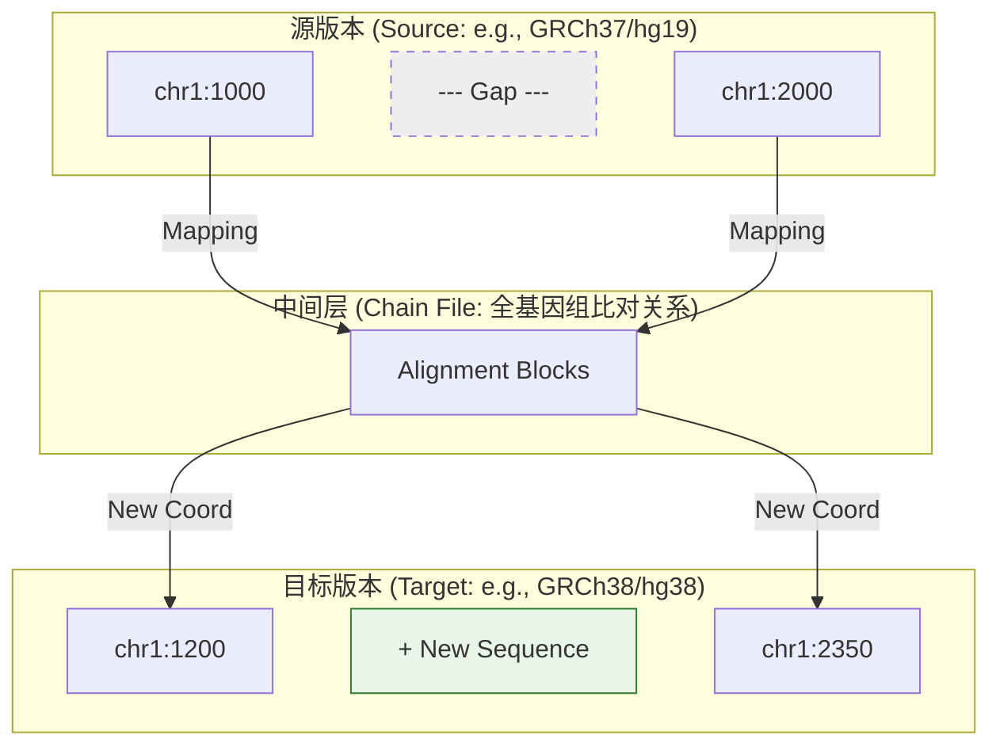

import SummaryBox from '@/components/docs/SummaryBox.astro';
import PrerequisitesBox from '@/components/docs/PrerequisitesBox.astro';
import ComparisonTable from '@/components/docs/ComparisonTable.astro';
import WorkflowSteps from '@/components/docs/WorkflowSteps.astro';
import ToolMappingBox from '@/components/docs/ToolMappingBox.astro';
import PitfallsBox from '@/components/docs/PitfallsBox.astro';
import RelatedLinks from '@/components/docs/RelatedLinks.astro';

<SummaryBox
  summary="参考基因组版本（如 GRCh37、GRCh38）是所有基因组坐标的空间背景。理解版本差异的本质、掌握坐标转换（liftover）的原理与局限，是确保数据整合准确性的基础。"
  bullets={[
    '参考版本差异不仅是命名问题：同一坐标字符串在不同版本下可能指向完全不同的基因组位置甚至不同碱基。',
    'liftover 基于版本间全基因组比对生成 chain files，实现坐标映射，但其成功依赖于区域间的明确对应关系。',
    '坐标转换后需同步更新注释版本、数据库资源和命名规范，仅转换坐标不足以保证语义一致性。',
  ]}
/>

## 问题背景

基因组分析中的所有坐标——reads 的比对位置、变异位点、基因区间——都依赖于一个隐含的参照系：**参考基因组**。当我们说"chr1:1234567"时，完整的语义应包括：参考版本（如 GRCh38）、坐标系统（1-based 或 0-based）、染色体命名规范（chr1 或 1）。

随着测序技术进步和基因组组装质量提升，参考基因组持续更新。人类基因组从 GRCh37 演进至 GRCh38，不仅修正了序列错误、填补了缺口，更重新排布了部分区域的坐标体系。这一演进带来一个核心问题：**如何理解和处理跨版本的数据整合？**

### 常见参考版本命名

| 命名体系 | 示例 | 说明 |
|:---:|:---|:---|
| **GRC 体系** | GRCh37、GRCh38 | Genome Reference Consortium 发布的 assembly 版本，人类基因组主版本 |
| **UCSC 体系** | hg19、hg38 | UCSC Genome Browser 的常用命名，hg19 大致对应 GRCh37，hg38 对应 GRCh38 |
| **Ensembl 体系** | GRCh37.p13、GRCh38.p14 | 包含补丁（patch）级别的版本号 |
| **物种特用** | GRCm39（小鼠）、Rnor_6.0（大鼠） | 不同物种有各自的 build 和 assembly 命名 |

### 坐标转换（liftover）

liftover 是将一个参考版本定义的基因组坐标，映射到另一参考版本的过程。

### 视觉化直觉：Liftover 映射逻辑

其技术基础是：

- **全基因组比对**：生成两个版本间的 chain files，记录区域间的对应、插入、删除和重排关系；
- **坐标映射**：基于比对关系，将源版本坐标转换为目标版本坐标；
- **映射结果分类**：成功映射（unique mapping）、多义映射（multiple mappings）、失败映射（unmapped）。

liftover 不是简单的坐标平移，而是依赖于区域间序列同源性的复杂映射过程。

## 版本一致性的重要性

参考版本不一致是生物信息学分析中最隐蔽也最危险的错误来源之一。其后果包括：

- **坐标语义偏移**：同一字符串表示的坐标（如 chr1:1234567）在不同版本下可能指向完全不同的基因组区域，甚至对应不同的碱基（由于序列修正或补丁）；
- **注释-数据错配**：使用 GRCh38 的注释文件解释基于 GRCh37 的比对结果，会导致基因定位错误、外显子/内含子判断失误；
- **数据库查询失败**：在 dbSNP 或 ClinVar 中查询坐标时，若参考版本不匹配，即使位点客观存在也可能"查无结果"；
- **跨研究整合偏差**：合并不同研究的数据时，若未统一参考背景，等同于将不同坐标系的数据强行拼接，产生系统性偏差。

版本一致性不是形式上的元数据问题，而是决定结果生物学解释有效性的基础约束。

<PrerequisitesBox
  items={[
    '先理解参考基因组、坐标系统与注释，因为 liftover 的前提就是坐标本身依赖参考背景。',
    '理解 BAM、VCF、GTF/GFF 这些文件都可能在 header、metadata 或下载说明里隐含版本信息。',
    '区分 assembly 名称、坐标命名规则（如 chr1 vs 1）和注释 release，它们不是完全同一个概念。',
  ]}
/>

## 先分清几个容易混淆的名字

<ComparisonTable
  leftTitle="你看到的名称"
  rightTitle="它更偏什么含义"
  rows={[
    {
      aspect: 'GRCh37 / GRCh38',
      left: '参考基因组 assembly 版本',
      right: '强调参考序列构建本身的版本背景。',
    },
    {
      aspect: 'hg19 / hg38',
      left: '常见的 UCSC 命名习惯',
      right: '实际使用时通常仍需确认与具体 assembly、命名规则和资源说明是否完全一致。',
    },
    {
      aspect: 'annotation release',
      left: '注释系统的发布版本',
      right: '决定 transcript / exon / gene 模型如何定义。',
    },
    {
      aspect: 'chr1 vs 1',
      left: '染色体命名规则',
      right: '看起来像小差异，但常会直接导致文件或工具不兼容。',
    },
  ]}
/>

## 什么时候需要特别关注版本与 liftover

### 1. 结果要和公共数据库对照

例如：

- 你的 VCF 是 GRCh38；
- 某个数据库、注释资源或历史结果还停留在 GRCh37；
- 这时即使是同一个变异，也不能直接按坐标字符串比较。

### 2. 不同研究之间要合并或比较结果

如果一份数据在 hg19，另一份在 hg38，直接做交集、meta 分析或区域统计通常会出问题。先统一参考背景才有意义。

### 3. 历史数据和新流程并存

很多旧项目、旧队列或下游资源仍然建立在旧版本上，而新分析逐渐迁移到更新版本。是否 liftover，决定了你是让旧结果去适配新背景，还是在旧背景中维持兼容。

## 如何确认一个文件或结果到底基于哪个版本

常见的检查入口包括：

- **BAM / CRAM**：看 header 里的 `@SQ`、参考序列名称和长度；
- **VCF**：看 header 里的 `##reference=`、contig 信息和生成说明；
- **GTF / GFF**：看 metadata、下载来源和 annotation release 说明；
- **数据库或资源页面**：看是否明确写了 “GRCh37-based” / “GRCh38-based”；
- **流程文档 / README / methods**：看项目是否记录了 assembly、annotation version 和相关资源版本。

如果还是不能确认，至少做两步交叉核对：

1. 选几个已知基因或变异位置，在候选版本中比较是否一致；
2. 检查染色体命名、参考长度和注释版本是否能与现有文件相互对应。

## liftover 的基本思路

liftover 依赖的是不同参考版本之间的全基因组比对关系。它并不是“旧坐标 + 常数偏移”，而是：

- 先根据版本之间的 alignment 生成 chain files；
- 再寻找旧版本坐标所在区间与新版本区间的对应关系；
- 最终把旧坐标转换成新坐标，或标记为 unmapped / 不可靠映射。

因此，liftover 能处理的前提是：目标区间在两个版本之间存在足够清晰的对应关系。

## liftover 能做什么，不能做什么

### 能做什么

- 在许多常规区域里，把旧版本坐标映射到新版本；
- 帮助历史结果与新注释、新数据库或新流程放到同一参考背景下；
- 为多研究整合提供统一坐标框架。

### 不能保证什么

- 不能保证所有位点都能成功映射；
- 不能保证映射后仍处于完全相同的功能语义环境；
- 不能自动修复注释版本、数据库版本和命名规则的不一致；
- 不能替代对复杂区域、结构变异或边界位点的人工核查。

## 一个稳妥的 liftover 工作流

<WorkflowSteps
  steps={[
    {
      title: '确认源版本与目标版本',
      badge: '前提',
      description: '先确认原始结果到底来自哪个参考版本，目标又要统一到哪个版本。',
      hint: '如果源版本都不确定，后面的转换就没有意义。',
    },
    {
      title: '检查相关文件是否同步',
      badge: '一致性',
      description: '同时检查注释、数据库背景和染色体命名规则是否也要随之统一。',
      hint: '坐标统一了，不代表 annotation release 自动统一。',
    },
    {
      title: '执行坐标转换',
      badge: '转换',
      description: '使用对应版本之间的链文件，把旧坐标映射到新版本。',
      hint: '部分区间可能会失败或出现多义映射。',
    },
    {
      title: '核查 unmapped 与关键位点',
      badge: '质控',
      description: '检查失败比例，并对重点位点、重点基因区域做人工核查。',
      hint: '大规模成功不代表关键位点一定没问题。',
    },
    {
      title: '更新解释背景',
      badge: '落地',
      description: '把结果重新接到匹配的新注释、新数据库和下游解释流程上。',
      hint: '坐标转完后，真正的解释工作才完成闭环。',
    },
  ]}
/>

## 示例：历史数据的版本迁移与 liftover 流程

假设项目中需要整合一份来源于 GRCh37 的历史 VCF 文件，而当前分析流程、注释资源和数据库查询均基于 GRCh38。以下是一种稳妥的处理策略：

**步骤 1：版本确认**
- 检查 VCF 文件 header 中的 `##reference=` 字段
- 查阅项目文档，确认生成该 VCF 时使用的参考基因组版本
- 验证染色体命名规范（chr1 或 1）和 contig 长度是否与候选版本匹配

**步骤 2：目标环境核查**
- 确认当前分析流程使用的注释文件（GTF/GFF）版本
- 确认计划查询的数据库资源（gnomAD、ClinVar 等）的主版本
- 评估是否需要同步统一染色体命名规范

**步骤 3：执行坐标转换**
- 获取 GRCh37→GRCh38 的 chain file（如从 UCSC 或 Ensembl 下载）
- 使用 liftover 工具（如 CrossMap、UCSC liftOver）执行坐标转换
- 记录转换统计：成功映射比例、失败位点列表、多义映射情况

**步骤 4：质量控制**
- 重点关注 unmapped 位点：是否集中在复杂区域（如着丝粒、端粒、高重复区域）
- 抽样验证关键候选位点：在目标版本中手动确认坐标准确性
- 对比转换前后候选位点的数量变化，评估是否影响研究结论

**步骤 5：解释背景更新**
- 对转换后的坐标重新执行注释流程（如 VEP、ANNOVAR）
- 使用目标版本对应的数据库重新查询变异信息
- **关键**：不可直接沿用旧版本上的注释结论或数据库查询结果

**核心认知**：liftover 的目标不是简单"更新文件格式"，而是将历史数据重新纳入当前的参考背景中进行一致性解释。坐标转换只是第一步，后续的注释、数据库整合和生物学解读都需要在新版本框架下重新进行。

## 与真实工具或流程的连接

<ToolMappingBox
  items={[
    'variant calling、annotation、feature counting 和数据库对照等步骤，都默认结果位于某个明确的参考背景里。',
    '很多转换工具只负责坐标层映射，并不自动帮你统一 annotation release、数据库版本和命名规则。',
    '在真实项目中，liftover 常出现在旧数据复用、多队列整合和数据库版本迁移这三类场景里。',
  ]}
/>

## 常见误区

<PitfallsBox
  items={[
    '把 GRCh37 和 hg19 当成完全无需核查的同义词。',
    '只做坐标 liftover，就认为注释和数据库背景也自动统一了。',
    '看到转换成功率很高，就默认每个关键位点都没有问题。',
    '忽略 chr 前缀、contig 命名和 header 信息，只按位置数字硬比对。',
    '在同一项目里混用多个版本，却没有明确记录每一步使用的参考背景。',
  ]}
/>

## 相关页面

<RelatedLinks
  links={[
    {
      title: '参考基因组、坐标系统与注释',
      to: '/docs/foundations/reference-and-annotation',
      label: '基础背景',
      description: '先打稳参考、坐标和注释的基础，再理解版本迁移为什么重要。',
    },
    {
      title: '数据库与注释系统一览',
      to: '/docs/data-references/databases-and-annotations',
      label: '解释层',
      description: '理解数据库对象、ID 与版本体系为什么必须和参考背景一起看。',
    },
    {
      title: '常见数据格式总览',
      to: '/docs/data-references/common-formats-overview',
      label: '文件层级',
      description: '把 BAM、VCF、GTF 等文件重新放回流程层级里理解。',
    },
    {
      title: 'DNA-seq 变异检测总览',
      to: '/docs/variants/variant-calling-overview',
      label: '实战流程',
      description: '看参考版本选择如何直接影响变异检测、过滤和后续解释。',
    },
  ]}
/>
