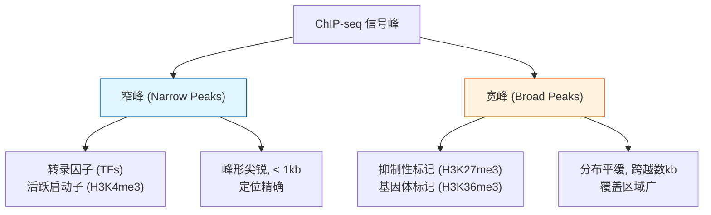

## 问题背景

### 核心问题：蛋白质在基因组上的结合位置

基因表达受到精细的调控，而转录因子（Transcription Factors, TFs）和组蛋白修饰是这一调控网络的核心执行者。然而，**在复杂的基因组上，这些调控元件究竟位于何处？**

ChIP-seq（Chromatin Immunoprecipitation sequencing）正是为解决这一核心问题而诞生的技术。它能够以全基因组范围、单碱基分辨率定位特定蛋白质的结合位点。

### ChIP-seq 解决的生物学问题

ChIP-seq 可以回答：
- 某个转录因子在全基因组范围内结合哪些位点？
- 特定的组蛋白修饰（如激活性的 H3K27ac 或抑制性的 H3K27me3）分布在哪里？
- 不同细胞类型或处理条件下，蛋白质结合图谱如何变化？

这些问题的答案对于理解基因调控网络至关重要。

### 基本原理

ChIP-seq 的核心思想是**免疫富集与测序定位**的结合：

1. **交联固定**：用甲醛将蛋白质与 DNA 共价交联，"冻结"瞬时结合状态
2. **染色质片段化**：超声或酶切将染色质打断为小片段（通常 200-500 bp）
3. **免疫沉淀（IP）**：用特异性抗体富集目标蛋白结合的 DNA 片段
4. **测序与定位**：解交联、提取 DNA、测序，并将 reads 比对到参考基因组
5. **峰识别**：通过统计方法识别显著富集的区域

<figure>
  
  <figcaption>ChIP-seq 的核心思想是把目标蛋白结合或修饰富集的 DNA 片段挑出来，再通过测序还原它们在基因组上的位置。</figcaption>
</figure>

## 数据特征与生物学解释

### 相对富集信号

ChIP-seq 的本质是**比较富集**：我们检测的是目标蛋白结合位点相对于基因组背景的富集程度，而非绝对数量。

这一设计基于关键洞察：
- 基因组的大部分区域不与目标蛋白结合
- 在免疫沉淀后，结合区域的 DNA 片段应显著富集
- 通过对比"ChIP 样本"与"对照样本"，可以识别真实的结合位点

### 两类峰的生物学含义



根据目标蛋白的生物学特性，ChIP-seq 信号呈现两种典型模式：

**窄峰（Narrow Peaks）**
- **代表**：转录因子（如 CTCF、PU.1）、活跃启动子标记（H3K4me3）
- **特征**：峰形尖锐，通常 < 1 kb
- **原因**：转录因子结合于特定的 DNA 序列（motif），位置精确

**宽峰（Broad Peaks）**
- **代表**：抑制性标记（H3K27me3）、基因体标记（H3K36me3）
- **特征**：分布平缓，可跨越数 kb 至数十 kb
- **原因**：组蛋白修饰可沿染色质传播，或覆盖较大区域

正确识别峰的类型对于选择分析参数至关重要。窄峰需要高分辨率检测，宽峰则需要允许信号在空间上延展的算法。

## 标准分析流程

ChIP-seq 分析需要系统性地从原始数据提取生物学信号：

### 1. 数据预处理

**质控（QC）**：评估测序数据质量
- 碱基质量分布（Q30 比例）
- 接头序列残留
- 重复率（反映文库复杂度）

**比对（Alignment）**：将 reads 定位到参考基因组
- 常用工具：Bowtie2、BWA
- 输出：排序后的 BAM 文件

**去噪**：
- 去除低质量比对（MAPQ < 30）
- 去除 PCR duplicates（防止高重复序列虚假富集）
- 去除 ENCODE 黑名单区域（测序假象热点）

### 2. 峰调用（Peak Calling）

峰调用是 ChIP-seq 的核心步骤，其统计原理见 [MACS2 峰调用算法](./macs2-peak-calling.mdx)。基本思想是：

> 对每个候选基因组窗口，判断 ChIP 样本的 read 覆盖是否显著高于背景（Input 对照）。

标准命令示例：

```bash
macs2 callpeak \
  -t chip.bam \
  -c input.bam \
  -f BAM \
  -g hs \
  -n H3K27ac \
  --outdir macs2_out
```

关键参数说明：
- `-t`：ChIP 样本 BAM 文件
- `-c`：对照样本（Input 或 IgG）
- `-g`：基因组大小（`hs` 表示人类）

### 3. 峰注释（Peak Annotation）

识别峰后，需要回答生物学位置问题：
- 峰位于启动子、增强子还是基因体？
- 峰附近有哪些基因？
- 不同样本的差异峰可能影响哪些通路？

常用工具：
- **HOMER**：功能注释与 motif 分析
- **ChIPseeker**：R 包，提供可视化与注释
- **bedtools closest**：查找最近的基因

### 4. Motif 分析

对于转录因子 ChIP-seq，motif 分析是验证与深入理解的关键步骤：

**De novo motif discovery**：在峰序列中发现富集的序列模式
- 验证：发现的 motif 是否与已知 TF 一致？

**已知 motif 富集**：与数据库（JASPAR、HOCOMOCO）比较
- 推断：协同作用的转录因子

序列模型基础见 [PWM / PSSM](../models/pwm-pssm.md)。

## 统计视角与差异分析

### 峰调用的统计本质

峰调用本质上是**局部富集检验**：
- 零假设（H₀）：某区域的 read 覆盖与背景无异
- 备择假设（H₁）：某区域的 read 覆盖显著高于背景

由于基因组上有数百万个候选窗口，必须进行严格的多重检验校正（如 FDR < 0.01）。

### 差异结合分析

比较不同条件（如处理 vs. 对照）的蛋白质结合变化，需要更精细的统计模型：

**数据转换**：
- 对每个峰，计算各样本的 read 计数
- 构建峰 × 样本的计数矩阵

**统计模型**：
- 使用负二项分布模型（类似 RNA-seq 差异表达分析）
- 工具：DESeq2、edgeR、DiffBind

**生物学解释**：
- 差异峰代表条件特异性的调控变化
- 需要结合基因表达数据验证功能影响

## 数据可视化

可视化是理解 ChIP-seq 数据的重要手段：

### 基因组浏览器（Genome Browser）
- **IGV**、**UCSC Genome Browser**：查看局部峰形
- 可叠加多个样本、基因注释、保守性等信息
- 适合验证特定区域的结合模式

### 热图与信号图谱（Heatmap / Profile Plot）
- 围绕转录起始位点（TSS）或峰中心绘制信号分布
- 揭示蛋白质结合的空间模式
- 比较不同样本的信号一致性

### 峰比较可视化
- **Venn 图**：显示峰集合的交集
- **Upset plot**：更适合比较多组样本的共享峰
- 帮助理解条件特异性与共享调控

## 质量控制指标

评估 ChIP-seq 数据质量需要多维度的指标：

| 指标 | 含义 | 质量参考值 |
|------|------|-----------|
| FRiP | Fraction of Reads in Peaks，峰内 reads 比例 | > 1%（TF 通常 > 5%） |
| NSC | Normalized Strand Cross-correlation，标准化链交叉相关 | > 1.05 |
| RSC | Relative Strand Cross-correlation，相对链交叉相关 | > 0.8 |
| 重复率 | PCR duplicates 比例 | < 20% |
| 峰数量 | 检测到的峰总数 | 依赖抗体和目标 |

**FRiP** 是最重要的质量指标：它反映测序 reads 有多少落在峰区域。高质量的 ChIP 实验应有显著比例的 reads 在峰内。

**NSC / RSC** 反映峰信号的清晰度，与抗体质量和靶点特性相关。

## 常见误区与正确理解

### 误区 1：没有 Input 对照也能可靠检测峰

**误解**：ChIP 样本的覆盖度可以直接用于峰识别，不需要 Input 对照。

**正确理解**：Input 对照至关重要。基因组不同区域的本底信号差异很大：
- 开放染色质区域天然有更多断裂的 DNA
- 重复序列区域的比对偏差
- 测序深度和 GC 含量偏好

没有 Input 对照，这些系统性偏差会被误判为真实的蛋白结合信号。

### 误区 2：峰越高，调控作用越强

**误解**：峰的信号强度（高度/覆盖度）直接反映调控强度。

**正确理解**：峰高受多种技术因素影响：
- 测序深度
- 抗体亲和力和特异性
- 目标蛋白的表达水平
- 染色质的可及性

生物学上，低峰可能对应强调控（如关键转录因子的单一位点），高峰可能只是技术假象。

### 误区 3：峰最近的基因就是靶基因

**误解**：增强子只调控最近的基因。

**正确理解**：增强子-启动子相互作用可以跨越数十甚至数百 kb，跳过中间基因。简单的"最近基因"策略会：
- 错过真实的远程调控
- 将峰错误关联到无关基因

正确的注释需要结合三维基因组信息或表达相关性。

### 误区 4：不同实验的结果可以直接比较

**误解**：不同实验室、不同批次的数据可以直接合并分析。

**正确理解**：ChIP-seq 结果高度依赖实验条件：
- 抗体批次差异
- 交联时间和片段化条件
- 细胞状态和培养条件

比较分析需要严格的批次校正和标准化。

## 历史背景与关键文献

ChIP-seq 技术的发展经历了从低通量到高通量的演进：

**技术演进**：
- ChIP-on-chip（2000s）：使用微阵列检测，分辨率有限
- ChIP-seq（2007+）：高通量测序革命，单碱基分辨率
- 单细胞 ChIP-seq（2015+）：细胞分辨率调控分析

**奠基性文献**：
- Johnson et al. (2007). Genome-wide mapping of in vivo protein-DNA interactions. *Science*. （早期 ChIP-seq）
- Zhang et al. (2008). Model-based Analysis of ChIP-Seq (MACS). *Genome Biology*. （峰调用算法）
- ENCODE Project Consortium (2012). An integrated encyclopedia of DNA elements in the human genome. *Nature*. （大规模 ChIP-seq 应用）

**资源**：
- ENCODE ChIP-seq 数据标准与质控指南
- modENCODE 模式生物调控图谱
- ChIP-Atlas 数据库：已发表 ChIP-seq 数据的整合

## 与其他页面的连接

- **技术互补**：ChIP-seq 与 [ATAC-seq](./atac-seq.md) 是研究基因调控的两种核心方法，分别回答"哪个蛋白结合"和"哪里开放"
- **算法深入**：峰调用的统计原理见 [MACS2 峰调用算法](./macs2-peak-calling.mdx)
- **序列模型**：motif 分析涉及 [PWM / PSSM](../models/pwm-pssm.md) 的概率模型
- **表观遗传整合**：与 [DNA 甲基化](./dna-methylation.md) 数据联合分析可全面理解调控状态
- **基础参考**：基因注释信息见 [参考基因组与注释](../foundations/reference-and-annotation.md)
