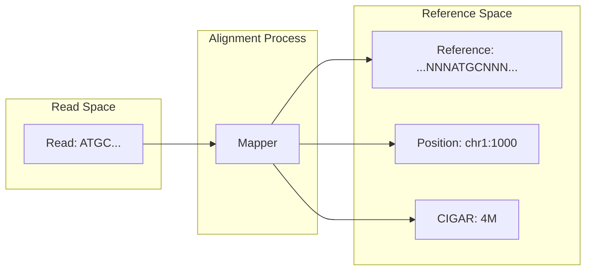

import SummaryBox from '@/components/docs/SummaryBox.astro';
import PrerequisitesBox from '@/components/docs/PrerequisitesBox.astro';
import WorkflowSteps from '@/components/docs/WorkflowSteps.astro';
import RelatedLinks from '@/components/docs/RelatedLinks.astro';
import PitfallsBox from '@/components/docs/PitfallsBox.astro';
import ComparisonTable from '@/components/docs/ComparisonTable.astro';
import ToolMappingBox from '@/components/docs/ToolMappingBox.astro';


<SummaryBox
  summary="文件格式是生物信息学分析中的核心抽象层。本章不赘述具体命令参数，而是阐明每种格式编码了什么样的生物学对象、在什么分析阶段出现、以及它们之间不可替代的语义差异。"
  bullets={[
    'FASTA、FASTQ、SAM/BAM、GTF/GFF、VCF 分别对应序列、原始观测、比对结果、注释信息、变异候选五个不同的抽象层次',
    '混淆这些格式的本质是在混淆分析流程中不同阶段的证据类型和计算对象',
    '理解格式的语义边界，是正确设计分析流程和排查错误的前提',
  ]}
/>

## 为什么需要关注数据格式

想象你正在分析一个肿瘤样本的外显子测序数据。你手头有五个文件：`reference.fa`、`sample.fastq`、`aligned.bam`、`genes.gtf`、`variants.vcf`。表面看来，它们都是"包含序列信息的文本文件"，但这种看法掩盖了关键事实：**这些文件编码的是完全不同的计算对象**。

生物信息学数据格式不是简单的存储容器，而是**特定层次生物学概念的计算表示**：

- **FASTA** 表示参考序列——一个坐标系统的骨架
- **FASTQ** 表示原始测序观测——带质量分数的碱基读取
- **SAM/BAM** 表示比对结果——reads 在参考坐标系中的定位
- **GTF/GFF** 表示功能注释——基因组特征的结构化描述
- **VCF/BCF** 表示变异候选——基于证据的序列差异推断

混淆这些格式的本质，是在混淆分析流程中不同阶段的**证据类型**和**计算对象**。本章的目标是建立清晰的语义分层，使你能准确判断：一个文件到底保存了什么、没有保存什么、以及为什么不能和名字相近的格式互相替代。

## 格式问题的典型表现

许多分析错误的根源不是命令参数，而是对格式边界的误解：

- **参考版本不一致**：使用 `GRCh37` 的 BAM 文件配合 `GRCh38` 的 VCF 注释
- **坐标系统混淆**：混淆 0-based 与 1-based 坐标，或不同参考补丁版本
- **层级错位**：将 feature-level 的 GTF 文件当作 read-level 的证据使用
- **语义信息缺失**：误以为 VCF 包含产生变异调用的全部 read-level 证据

理解数据格式的语义边界，是正确设计分析流程和有效排错的基础能力。

<PrerequisitesBox
  items={[
    '先阅读生物信息学中的基础对象，建立 reads、参考基因组、注释等对象概念。',
    '理解同一个流程中的输入和输出往往对应不同抽象层，而不是“同一批数据换个后缀”。',
    '如果还不熟悉版本与坐标体系，先回看参考基因组、坐标系统与注释。',
  ]}
/>

## 这一页和上层总览的分工

`数据、注释与资源` 板块里的[常见数据格式总览](../data-references/common-formats-overview.mdx)更强调“格式在整条流程里处在哪一层”。

这一页则更聚焦于：

- 某个文件实际保存什么；
- 它没有保存什么；
- 哪些名字相近的格式不能互相替代；
- 拿到一个交付包时，应该如何判断每个文件扮演什么角色。

## 名字相近，但职责不同

<ComparisonTable
  leftTitle="左侧格式"
  rightTitle="右侧格式"
  rows={[
    {
      aspect: 'FASTA vs FASTQ',
      left: 'FASTA 保存序列本身，常作为参考或组装结果，不带碱基质量。',
      right: 'FASTQ 保存 reads 和 base quality，通常是原始测序流程的起点。',
    },
    {
      aspect: 'SAM/BAM/CRAM',
      left: 'SAM 是文本形式，便于查看字段与调试。',
      right: 'BAM/CRAM 是更适合大规模分析的压缩表示，但本质仍是比对结果层。',
    },
    {
      aspect: 'GTF/GFF vs BED',
      left: 'GTF/GFF 更偏注释对象与属性关系，如 gene / transcript / exon。',
      right: 'BED 更像简洁区间列表，适合表示 peak、区域集合或窗口。',
    },
    {
      aspect: 'VCF vs BCF',
      left: 'VCF 是文本格式，便于查看候选变异及其字段。',
      right: 'BCF 是二进制表示，适合更高效存储和处理，但语义层仍是变异结果。',
    },
  ]}
/>

### 1. FASTA：参考序列的计算表示

**概念定义**

FASTA 格式编码的是**参考序列（reference sequence）**——一个生物分子序列（DNA、RNA 或蛋白质）的字符串表示。它是整个生物信息学坐标系统的骨架：所有比对、注释和变异检测都相对于某个特定的参考序列版本进行。

**数据结构**

```
>chr1 Homo sapiens chromosome 1, GRCh38
NNNNNNNNNNNNNNNNNNNNNNNNNNNNNNNNNNNNNNNN...
```

每条序列由一个以 `>` 开头的定义行（包含序列标识符和描述）后跟序列字符行组成。关键点：**FASTA 只包含序列字符本身，不包含任何关于该序列如何产生、如何被测量、或与其他序列关系的元数据**。

**计算语义**

- **输入角色**：比对算法的参考输入、基因组浏览器的坐标骨架、引物设计的模板
- **约束条件**：必须与配套注释文件（如 GTF）使用相同的参考版本和坐标系统
- **不包含**：测序质量分数、比对位置信息、功能注释、变异证据

**与其他格式的关系**

FASTA 和 GTF/GFF 经常成对出现，但编码不同层次的对象：FASTA 是**序列层**，GTF/GFF 是**注释层**。前者回答"坐标 X 处的碱基是什么"，后者回答"坐标 X-Y 区域对应什么生物学特征"。

---

### 2. FASTQ：原始测序观测的容器

**概念定义**

FASTQ 格式编码的是**原始测序 reads（raw sequencing reads）**——测序仪直接输出的碱基序列及其对应的质量分数（Phred quality scores）。这是分析流程的起点，承载着实验观测的原始证据。

**数据结构**

```
@SEQ_ID
GATTTGGGGTTCAAAGCAGTATCGATCAAATAGTAAATCCATTTGTTC
+
!''*((((***+))%%%++)(%%%%).1***-+*''))**55CCF>>>
```

每条 read 由四行组成：标识符行、序列行、分隔行（`+`）、质量分数行。质量分数用 ASCII 字符编码，表示测序仪对每个碱基调用可靠性的置信度估计。

**计算语义**

- **证据类型**：实验观测层（observational layer），未经任何参考序列比对或生物学解释
- **核心属性**：包含碱基序列 + 测序质量分数（error probability）
- **分析起点**：质控、比对、定量、组装等流程的初始输入
- **约束条件**：不包含参考坐标位置、功能注释、或变异推断信息

**关键理解**

仅拥有 FASTQ 文件，你尚未建立**任何**与参考基因组的关联。read 在参考上的位置、是否来自外显子或内含子、是否存在变异——这些都需要下游分析步骤才能确定。

### 3. SAM / BAM / CRAM：比对结果的标准编码

**概念定义**

SAM（Sequence Alignment/Map）及其二进制形式 BAM、压缩形式 CRAM 编码的是**比对结果（alignment）**——将原始 reads 定位到参考序列坐标系中的计算产物。这是从原始观测到参考坐标空间的映射层。



**数据结构核心**

每条比对记录包含 11 个必需字段：
- **QNAME**：read 标识符
- **FLAG**：比对状态位标记（如是否 paired、是否 reverse complement）
- **RNAME**：参考序列名称
- **POS**：1-based 起始位置
- **MAPQ**：比对质量分数（mapping confidence）
- **CIGAR**：比对操作的紧凑编码（Match/Mismatch/Insertion/Deletion）
- **RNEXT/PNEXT/TLEN**：配对 read 信息
- **SEQ/QUAL**：序列和质量分数（可能与原始 FASTQ 不同，如经 soft-clipping）

**计算语义**

- **转换层**：从 read-space 到 reference-space 的坐标变换
- **证据类型**：定位后的观测证据，保留原始 reads 与参考位置的关系
- **核心操作**：CIGAR 字符串编码序列差异（match/mismatch/indel）
- **约束条件**：比对结果依赖特定的参考版本；不同比对器/参数产生不同结果

**格式变体关系**

- **SAM**：文本格式，便于人工阅读和调试
- **BAM**：二进制压缩格式，适合高效存储和大规模分析
- **CRAM**：参考感知的压缩格式，通过存储与参考的差异实现更高压缩率

三者**语义等价**，仅在存储效率上有差异。

### 4. GTF / GFF：基因组注释的结构化表示

**概念定义**

GTF（Gene Transfer Format）和 GFF（General Feature Format）编码的是**基因组注释（genome annotation）**——参考序列上功能元素的位置和属性描述。这是从序列层到生物学功能层的语义映射。

**数据结构核心**

九列制表分隔格式：
```
chr1  HAVANA  gene  11869  14409  .  +  .  gene_id "ENSG00000223972"; gene_type "transcribed_unprocessed_pseudogene";
```

- **seqname**：参考序列名称
- **source**：注释来源
- **feature**：特征类型（gene、transcript、exon、CDS、UTR 等）
- **start/end**：1-based 起止坐标
- **score/strand/phase**：附加属性
- **attributes**：键值对形式的特征属性（gene_id、transcript_id 等）

**计算语义**

- **注释层**：将参考坐标映射到生物学概念（基因、转录本、外显子）
- **层级结构**：通过属性字段（如 parent-child 关系）编码特征的嵌套结构
- **应用核心**：RNA-seq 定量（feature counting）、变异功能注释、差异表达分析
- **约束条件**：注释与参考序列版本必须匹配（如 GRCh38 + GENCODE v42）

**GTF vs GFF**

- **GTF** 是 GFF2 的严格子集，强制要求某些字段格式（如 gene_id/transcript_id）
- **GFF3** 是更通用的格式，支持任意特征类型和更灵活的属性定义
- 两者在基因结构注释场景下**功能等价**，但在工具兼容性上有差异

### 5. BED：区间列表的简洁表示

**概念定义**

BED（Browser Extensible Data）编码的是**区间集合（interval sets）**——参考序列上的一组坐标范围。这是一种轻量级的区域描述格式，强调简洁性和区间运算的便利性。

**数据结构**

3 到 12 列的可变格式，最少只需要：
```
chr1  1000  5000
```

扩展列可包含：名称、分数、链方向、以及其他显示属性。

**计算语义**

- **区间层**：纯粹的坐标范围，不强制要求生物学语义
- **典型应用**：peak 区域（ChIP-seq）、靶标区域 panel、CNV 区间、窗口划分
- **与 GTF 的区别**：BED 是**扁平区间列表**，GTF 是**层级化注释结构**
- **约束条件**：0-based 起始坐标（与 GTF 的 1-based 不同），half-open 区间

**坐标系统注意**

BED 使用 **0-based, half-open** 坐标系统（如 `0-100` 表示第 1-100 个碱基），而 GTF 使用 **1-based, closed** 坐标系统（如 `1-100`）。这是两个格式间最容易导致错误的差异。

### 6. VCF / BCF：变异候选的标准编码

**概念定义**

VCF（Variant Call Format）及其二进制形式 BCF 编码的是**变异候选（variant calls）**——基于比对证据推断的序列差异。这是从比对层到变异解释层的抽象。

**数据结构核心**

- **Meta-information 行**（`##` 开头）：文件格式版本、参考序列、INFO/FORMAT 定义
- **Header 行**（`#CHROM...`）：列名和样本列表
- **Data 行**：每条变异记录包含：
  - **CHROM/POS/ID/REF/ALT**：位置、标识符、参考/替代等位基因
  - **QUAL**：质量分数（Phred-scaled）
  - **FILTER**：过滤状态
  - **INFO**：变异属性（如 DP=深度，AF=等位基因频率）
  - **FORMAT**：样本级字段格式
  - **样本列**：每个样本的基因型（GT）和其他属性

**计算语义**

- **推断层**：基于 BAM 比对证据和统计模型产生的**候选**变异，非绝对真理
- **证据依赖**：VCF 不保存产生调用的全部 read-level 证据，仅保存聚合后的统计信息
- **上下文依赖**：变异的解释依赖参考版本、调用工具、过滤参数、注释数据库
- **应用场景**：变异过滤、注释、疾病关联分析、群体遗传学研究

**VCF vs BCF**

- **VCF**：文本格式，便于查看和人工检查
- **BCF**：二进制格式，支持高效随机访问和大规模处理
- 两者**语义等价**，BCF 更适合作为分析中间格式，VCF 更适合最终报告和归档

## 一个典型流程里格式如何流动

<WorkflowSteps
  steps={[
    {
      title: '原始测序',
      description: '实验输出通常先以 FASTQ 形式进入分析流程。',
      hint: '这里持有的是 reads 本身和碱基质量，而不是坐标或变异解释。',
    },
    {
      title: '参考与注释',
      description: '分析常同时依赖 FASTA 参考序列和 GTF/GFF 注释文件。',
      hint: '参考版本与注释版本需要匹配，但它们本身也不是 reads 证据。',
    },
    {
      title: '比对 / 定位',
      description: 'reads 被放到参考坐标系中后，结果通常保存在 SAM/BAM/CRAM。',
      hint: '此时才真正获得位置信息、CIGAR、MAPQ 等定位层数据。',
    },
    {
      title: '下游分析',
      description: '变异检测常输出 VCF/BCF，表达分析则输出 counts、矩阵或其他 feature-level 结果。',
      hint: '不同任务最后交付的“结果文件”并不处于同一语义层。',
    },
  ]}
/>

## 综合实例：分析交付包的结构解析

假设你收到一个肿瘤外显子测序的分析交付包，包含以下文件：

```
project/
├── reference.fa          # 参考基因组序列
├── genes.gtf             # 基因结构注释
├── sample.bam            # 比对结果（含索引 .bai）
└── sample.vcf.gz         # 变异检测结果
```

表面看来，它们都是"包含序列信息的文件"，但这是一种危险的简化。正确的理解方式是**按语义层次分类**：

### 层次解析

| 文件 | 语义层次 | 核心内容 | 功能定位 |
|------|----------|----------|----------|
| `reference.fa` | **参考层** | 参考序列坐标骨架 | 建立坐标系统的基准框架 |
| `genes.gtf` | **注释层** | 基因-转录本-外显子层级结构 | 将坐标映射到生物学功能 |
| `sample.bam` | **证据层** | reads 在参考上的定位结果 | 保存实验观测的空间分布 |
| `sample.vcf.gz` | **推断层** | 候选变异位点及统计信息 | 基于证据的序列差异推断 |

### 依赖关系分析

这些文件之间存在明确的依赖链条：

1. **VCF 依赖 BAM**：变异调用是基于比对证据的统计推断，VCF 中记录的每个变异都有对应的 BAM 中的 read pileup 支持（但注意：VCF 不保存原始 reads，只保存统计摘要）

2. **BAM 依赖 reference.fa**：比对结果的意义完全依赖于所使用的参考版本。同样的 BAM 文件配合不同版本的参考序列会产生错误的解释

3. **所有功能解释依赖 genes.gtf**：VCF 中变异的功能影响（同义/错义/无义、剪接位点影响）需要结合 GTF 注释才能确定

### 单独使用各文件的局限性

- **只有 VCF**：失去原始证据链，无法验证变异的真实性；脱离参考版本和注释，无法解释变异的生物学意义
- **只有 BAM**：尚未经过变异检测算法处理，无法直接得到"存在什么变异"的结论
- **只有 reference.fa + genes.gtf**：只有背景框架，没有样本的实验证据

这一结构揭示了一个核心原则：**生物信息学分析交付包是一个多层次的证据-解释系统，各组件承担不可替代的角色，不能互相替换**。

## 与真实工具或流程的连接

<ToolMappingBox
  items={[
    'FASTQ 常连接到质控、比对、定量或组装入口，是原始观测层。',
    'BAM/CRAM 常连接到可视化、coverage、feature counting 与 variant calling，是定位证据层。',
    'GTF/GFF/BED 常连接到注释解释和区间操作，但它们不是原始样本证据。',
    'VCF/BCF 常连接到过滤、注释和数据库映射，是变异结果层而不是 read-level 证据层。',
  ]}
/>

## 常见概念误区

<PitfallsBox
  items={[
    '**格式等价性误解**：认为 FASTA 和 FASTQ 都是"序列文件"就可以互相替换。实际上两者编码完全不同的对象层：FASTA 是参考序列骨架，FASTQ 是带质量分数的实验观测。',
    '**信息自足性误解**：认为 BAM 文件包含"所有信息"，不再需要参考序列和注释文件。实际上 BAM 只包含定位结果，功能解释仍需依赖外部注释。',
    '**格式互换性误解**：认为 GTF/GFF 和 BED 都是"坐标文件"就可以在任何流程中等价替换。实际上两者的层级结构、坐标系统、语义信息有本质差异。',
    '**结果确定性误解**：认为 VCF 文件可以直接作为"最终结论"使用，无需关心 caller 算法、过滤参数和参考版本。实际上 VCF 是依赖上下文的统计推断，不是绝对真理。',
    '**技术无关性误解**：认为文件格式只是"实现细节"，不影响分析逻辑。实际上格式选择直接决定了数据结构的表达能力，进而影响分析策略的设计。',
  ]}
/>

## 本章小结与延伸阅读

### 核心要点回顾

- **数据格式是抽象层的编码**：每种格式对应生物信息学分析流程中的特定概念层（参考序列、原始观测、比对结果、功能注释、变异推断）
- **语义不等价**：名字相近的格式（如 GTF vs BED、VCF vs BCF）可能在功能上可互换，但在表达能力和约束条件上有重要差异
- **层次依赖性**：分析交付包中的文件形成依赖链条，孤立使用某一文件会导致解释错误

### 进阶学习路径

<RelatedLinks
  links={[
    {
      title: '参考基因组、坐标系统与注释',
      to: '/docs/foundations/reference-and-annotation',
      label: '基础层',
      description: '深入理解为什么数据格式必须与参考版本和坐标系统耦合使用。',
    },
    {
      title: 'DNA-seq 变异检测总览',
      to: '/docs/variants/variant-calling-overview',
      label: '应用层',
      description: '查看 FASTQ → BAM → VCF 在真实变异检测工作流中的完整转换过程。',
    },
    {
      title: 'RNA-seq 定量分析',
      to: '/docs/workflows/rna-seq',
      label: '应用层',
      description: '理解 GTF/GFF 在表达定量中的关键作用，以及与 BED 格式的选择考量。',
    },
    {
      title: '生物信息学数据库资源',
      to: '/docs/databases/',
      label: '资源层',
      description: '了解主流参考基因组和注释数据库的版本体系与获取方式。',
    },
  ]}
/>
