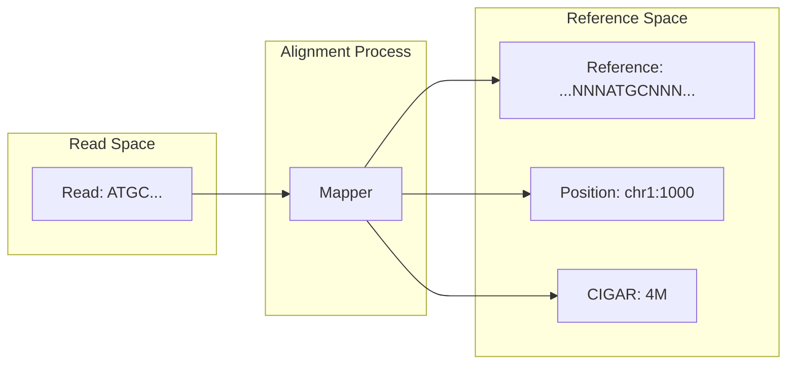

import SummaryBox from '@/components/docs/SummaryBox.astro';
import PrerequisitesBox from '@/components/docs/PrerequisitesBox.astro';
import PitfallsBox from '@/components/docs/PitfallsBox.astro';
import RelatedLinks from '@/components/docs/RelatedLinks.astro';
import ToolMappingBox from '@/components/docs/ToolMappingBox.astro';
import ComparisonTable from '@/components/docs/ComparisonTable.astro';
import PageHeaderMeta from '@/components/docs/PageHeaderMeta.astro';

<SummaryBox
  summary="SAM/BAM/CRAM 编码的是比对结果——reads 在参考基因组坐标系中的定位。理解其核心字段（FLAG、CIGAR、MAPQ、TAGs），是解读变异证据、可视化检查和下游分析的基础。"
  bullets={[
    'SAM 是文本格式，BAM 是二进制压缩格式，CRAM 是参考感知压缩格式',
    '11 个必需字段定义比对的核心信息：位置、方向、质量、CIGAR',
    'CIGAR 字符串编码 read 与参考之间的序列差异（匹配/错配/插入/缺失）',
    'FLAG 位标记编码比对状态（paired、reverse、duplicate 等）',
    '三者语义等价，仅在存储效率和访问方式上有差异',
  ]}
/>

<PageHeaderMeta section="Data References" />


## 是什么

**SAM（Sequence Alignment/Map）** 格式编码的是**比对结果（alignment）**——将原始 reads 定位到参考序列坐标系中的计算产物。



### 核心数据结构

每条比对记录包含 11 个**必需字段**（制表符分隔）：

| 列号 | 字段名 | 类型 | 说明 |
|------|--------|------|------|
| 1 | QNAME | 字符串 | Read 标识符（对应 FASTQ 中的 ID） |
| 2 | FLAG | 整数 | 位标记，编码比对状态 |
| 3 | RNAME | 字符串 | 参考序列名称（如 chr1） |
| 4 | POS | 整数 | 1-based 起始位置 |
| 5 | MAPQ | 整数 | 比对质量分数（Phred-scaled） |
| 6 | CIGAR | 字符串 | 比对操作紧凑编码 |
| 7 | RNEXT | 字符串 | 配对 read 的参考序列 |
| 8 | PNEXT | 整数 | 配对 read 的位置 |
| 9 | TLEN | 整数 | 观察到的模板长度 |
| 10 | SEQ | 字符串 | Read 序列 |
| 11 | QUAL | 字符串 | Read 质量分数（同 FASTQ） |

之后是可选的 **TAG 字段**，格式为 `TAG:TYPE:VALUE`（如 `NM:i:3` 表示 3 个错配）。

## 为什么重要

SAM/BAM 是分析流程中的**核心证据层**：

- **变异检测**依赖 BAM 中的 read pileup 和碱基质量
- **表达定量**依赖 BAM 中的 read 计数
- **可视化检查**（如 IGV）依赖 BAM 确认变异真实性
- **质控指标**（如覆盖度、插入片段分布）从 BAM 中提取

理解 BAM 字段结构，是排查分析错误、解释异常结果的前提。

<PrerequisitesBox
  items={[
    {name: 'FASTQ 格式', href: '/docs/formats/fastq-format'},
    {name: '参考基因组、坐标系统与注释', href: '/docs/foundations/reference-and-annotation'},
    {name: '全局比对与局部比对', href: '/docs/alignment/global-local'},
  ]}
/>

## FLAG 位标记系统

FLAG 是一个整数，其二进制表示编码多个比对属性：

| 位值 | 标志名 | 含义 |
|------|--------|------|
| 0x1 | PAIRED | read 是 paired-end |
| 0x2 | PROPER_PAIR | 配对比对正常 |
| 0x4 | UNMAP | read 未比对上 |
| 0x8 | MUNMAP | 配对 read 未比对上 |
| 0x10 | REVERSE | read 比对到负链 |
| 0x20 | MREVERSE | 配对 read 比对到负链 |
| 0x40 | READ1 | 这是 read 1 |
| 0x80 | READ2 | 这是 read 2 |
| 0x100 | SECONDARY | 次要比对 |
| 0x200 | QCFAIL | 未通过质控 |
| 0x400 | DUP | PCR 重复 |
| 0x800 | SUPPLEMENTARY | 补充比对（chimeric） |

### FLAG 解读示例

```
FLAG = 99 (二进制: 01100011)
= 0x1 (PAIRED) + 0x2 (PROPER_PAIR) + 0x20 (MREVERSE) + 0x40 (READ1)
```

这意味着：这是一个正常配对的 read 1，其配对 read 比对到负链。

## CIGAR 字符串

CIGAR（Concise Idiosyncratic Gapped Alignment Report）编码 read 与参考之间的序列差异：

| 操作符 | 含义 | 消耗参考？ | 消耗 read？ |
|--------|------|-----------|------------|
| M | 比对匹配（match/mismatch） | ✓ | ✓ |
| I | 插入（insertion） | ✗ | ✓ |
| D | 缺失（deletion） | ✓ | ✗ |
| N | 跳过参考区域（如剪接） | ✓ | ✗ |
| S | 软裁剪（soft clip） | ✗ | ✓ |
| H | 硬裁剪（hard clip） | ✗ | ✗ |
| P | 填充（padding） | ✗ | ✗ |
| = | 序列匹配 | ✓ | ✓ |
| X | 序列错配 | ✓ | ✓ |

### CIGAR 解读示例

```
CIGAR: 76M
```
→ 76 个碱基全部比对到参考上（可能包含匹配和错配）

```
CIGAR: 50M2I24M
```
→ 50 个匹配，2 个插入，24 个匹配

```
CIGAR: 30M1D45M
```
→ 30 个匹配，1 个缺失（参考上有但 read 上没有），45 个匹配

```
CIGAR: 10S60M6S
```
→ 两端各有 soft clipping（通常表示低质量或比对不确定区域）

## MAPQ 比对质量

MAPQ（Mapping Quality）衡量比对位置的置信度：

$$MAPQ = -10 \log_{10}(P_{mapping\ error})$$

| MAPQ | 错误概率 | 说明 |
|------|---------|------|
| 0 | 1 | 低质量或多次比对 |
| 10 | 0.1 | 10% 可能比对错误 |
| 20 | 0.01 | 常用阈值 |
| 30 | 0.001 | 高质量比对 |
| 60 | 10⁻⁶ | 极高置信度 |

**关键注意**：MAPQ = 0 通常表示 read 可以比对到多个位置（重复区域、多拷贝基因），在变异检测中应谨慎使用。

## SAM、BAM、CRAM 的关系

<ComparisonTable
  leftTitle="SAM"
  rightTitle="BAM"
  rows={[
    {
      aspect: '格式类型',
      left: '文本格式（人类可读）',
      right: '二进制压缩格式（BGZF）',
    },
    {
      aspect: '文件大小',
      left: '最大（~20-30 GB 全基因组）',
      right: '较小（~5-10 GB）',
    },
    {
      aspect: '访问速度',
      left: '慢（顺序读取）',
      right: '快（支持随机访问）',
    },
    {
      aspect: '典型用途',
      left: '调试、查看少量记录',
      right: '生产分析、可视化',
    },
  ]}
/>

<ComparisonTable
  leftTitle="BAM"
  rightTitle="CRAM"
  rows={[
    {
      aspect: '压缩原理',
      left: '通用压缩（BGZF）',
      right: '参考感知压缩（存储与参考的差异）',
    },
    {
      aspect: '文件大小',
      left: '中等',
      right: '最小（比 BAM 小 30-50%）',
    },
    {
      aspect: '依赖',
      left: '不依赖参考序列',
      right: '需要参考序列才能解码',
    },
    {
      aspect: '典型用途',
      left: '标准分析流程',
      right: '长期归档、节省存储',
    },
  ]}
/>

**三者语义等价**：SAM → BAM → CRAM 可以互相转换，信息不丢失（除非使用有损压缩选项）。

## 可选 TAG 字段

常见 TAG 字段包括：

| TAG | 类型 | 说明 |
|-----|------|------|
| `NM` | int | 编辑距离（错配+indel 数） |
| `MD` | string | 错配位置的字符串表示 |
| `AS` | int | 比对得分 |
| `XS` | int | 次优比对得分（用于 unique mapping 判断） |
| `RG` | string | Read group（样本/文库标识） |
| `PG` | string | 生成此记录的程序（如 BWA、Picard） |

## 与真实工具或流程的连接

<ToolMappingBox
  items={[
    '比对工具：BWA-MEM、Bowtie2、minimap2 输出 SAM，通常直接管道传输为 BAM',
    '排序与索引：samtools sort + samtools index 生成 coordinate-sorted BAM + .bai 索引',
    '重复标记：Picard MarkDuplicates 或 samtools flagstat 标记 PCR duplicates',
    '可视化：IGV、samtools tview 使用 BAM 进行变异检查和质控',
    '变异检测：GATK、FreeBayes、samtools mpileup 以 BAM 为输入',
  ]}
/>

## 常见概念误区

<PitfallsBox
  items={[
    '**BAM 包含所有信息**：BAM 只保存比对结果，功能解释仍需外部注释（如 GTF）。',
    '**MAPQ = 碱基质量**：MAPQ 衡量的是比对位置置信度，不是碱基调用质量（那是 FASTQ 的 QUAL）。',
    '**M = 完全匹配**：CIGAR 中的 M 包含匹配和错配，不等于完全一致。',
    '**忽略 FLAG**：不检查 UNMAP、DUP、QCFAIL 标志可能导致错误纳入低质量 reads。',
    '**CRAM 可脱离参考使用**：CRAM 解码必须提供对应的参考序列，否则无法还原原始数据。',
  ]}
/>

## 本章小结

- SAM/BAM/CRAM 编码比对结果，是**从 read-space 到 reference-space 的坐标映射**
- 11 个必需字段 + 可选 TAGs 定义完整的比对信息
- FLAG 编码状态，CIGAR 编码序列差异，MAPQ 编码位置置信度
- 三者语义等价，BAM 是生产标准，CRAM 适合归档

## 相关页面

<RelatedLinks
  links={[
    {
      title: 'FASTQ 格式',
      to: '/docs/formats/fastq-format',
      label: '上游格式',
      description: '比对前的原始 reads 容器，不含坐标信息。',
    },
    {
      title: 'VCF/BCF 格式',
      to: '/docs/formats/vcf-bcf-format',
      label: '下游格式',
      description: '基于 BAM 比对证据的变异调用结果。',
    },
    {
      title: '序列比对总论',
      to: '/docs/alignment/',
      label: '算法层',
      description: '理解比对算法（BWA、Bowtie2）如何生成 SAM/BAM。',
    },
    {
      title: 'DNA-seq 变异检测总览',
      to: '/docs/variants/variant-calling-overview',
      description: 'BAM 是变异检测的直接输入，read pileup 是变异证据的来源。',
    },
  ]}
/>
