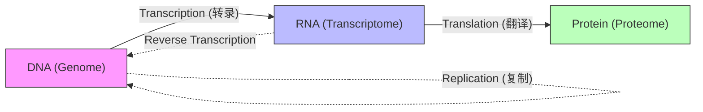

import SummaryBox from '@/components/docs/SummaryBox.astro';
import DefinitionList from '@/components/docs/DefinitionList.astro';
import RelatedLinks from '@/components/docs/RelatedLinks.astro';
import PrerequisitesBox from '@/components/docs/PrerequisitesBox.astro';
import PageHeaderMeta from '@/components/docs/PageHeaderMeta.astro';
import PitfallsBox from '@/components/docs/PitfallsBox.astro';

<SummaryBox
  summary="生物信息学并非研究抽象算法，而是处理一组互相转换、互相约束的生物学对象。理解这些对象及其背后的实验技术，是选择合适算法的前提。"
  bullets={[
    '区分 DNA、RNA 和蛋白质在信息载体、表达和功能层面的不同角色',
    '理解中心法则（Central Dogma）定义的生物信息流动',
    '掌握 PCR、克隆、电泳等产生原始测序数据的实验技术原理',
    '认识个体差异（0.1%）与物种差异在比较基因组学中的意义'
  ]}
/>

<PageHeaderMeta section="Foundations" />


## 1. 核心生物学对象

在算法抽象之前，我们需要明确处理的是什么对象：

<DefinitionList
  items={[
    {
      term: 'DNA (脱氧核糖核酸)',
      definition: '基因组信息的终极载体。由 A, T, G, C 四种碱基组成，双螺旋结构通过互补配对（Chargaff 规则）实现信息复制。',
    },
    {
      term: 'RNA (核糖核酸)',
      definition: '信息的中间传递者。在真核生物中需经过剪接（Splicing）去掉内含子，保留外显子形成 mRNA。',
    },
    {
      term: '蛋白质',
      definition: '生命的执行者。由 mRNA 上的密码子（Codon）翻译而成，决定了细胞的功能与结构。',
    },
    {
      term: 'Reads (测序读段)',
      definition: '测序仪产生的原始观测片段。它们是不完整的、带有误差的序列碎片，是组装和比对算法的输入。',
    },
  ]}
/>

## 2. 中心法则：生物信息的流动

**中心法则（Central Dogma）** 描述了遗传信息的标准流向：**DNA $\to$ RNA $\to$ 蛋白质**。



- **转录（Transcription）**：DNA 模板合成 RNA。
- **翻译（Translation）**：mRNA 在核糖体上按密码子表（Codon Table）组装氨基酸。
- **遗传密码的简并性**：多个密码子可对应同一种氨基酸（如 CGC 和 AGG 都编码精氨酸），这对基因预测算法中的统计偏好分析至关重要。

## 3. 基因的结构

在生物信息学中，"基因"不仅是抽象的概念，而是基因组上的一个**坐标区间**，具有明确的结构组成：

```text
          ┌───── Exon 1 ─────┐                ┌──── Exon 2 ────┐
──[Promoter]─[5'UTR]─────────[3'UTR]──Intron──[5'UTR]────────[3'UTR]──[PolyA]──>
          ↑                   ↑                ↑                ↑
       转录起始           剪接供体          剪接受体         转录终止
```

### 结构组件

- **启动子（Promoter）**：转录起始位点上游的调控区域，包含转录因子结合位点和核心启动子元件（如 TATA box）。位于基因的 5' 端上游。
- **外显子（Exon）**：出现在成熟 mRNA 中的序列，既包含编码蛋白质的区域，也包含非编码区域（UTR）。
- **内含子（Intron）**：在 RNA 剪接过程中被移除的序列。内含子的边界遵循 GT-AG 规则（供体位点 GT，受体位点 AG），这是剪接比对算法的核心信号。
- **5' UTR / 3' UTR**：成熟 mRNA 的非翻译区，不编码蛋白质但参与翻译调控和 mRNA 稳定性。
- **Poly-A 信号**：位于 3' 端的加尾信号，poly-A 尾巴是真核 mRNA 的重要特征，也是 RNA-seq 文库制备（oligo-dT 富集）的基础。

### 为什么这对算法重要

- **RNA-seq 比对**：reads 可能跨越外显子-内含子边界（spliced reads），需要剪接感知的比对器（如 STAR、HISAT2）。
- **基因表达定量**：reads 需要被正确归属到基因或转录本，这依赖准确的基因注释（GTF/GFF 文件）。
- **变异注释**：一个 SNP 的功能影响取决于它落在基因的哪个部分——启动子变异可能影响表达量，外显子变异可能改变蛋白质序列，内含子变异可能影响剪接。

## 4. 基因组与参考序列

### 什么是参考基因组

参考基因组（Reference Genome） 是一个物种的**共识序列**，它不代表任何一个个体，而是综合多个个体数据拼接而成的"标准"序列。

- **人类参考基因组**：目前主要使用 GRCh38（也叫 hg38），其前一个版本 GRCh37（hg19）仍有大量遗留数据。
- **版本差异的影响**：hg19 和 hg38 之间存在大量坐标偏移（特别是着丝粒附近），同一个 SNP 的位置在不同版本上可能不同。**混用不同版本的坐标是最常见的数据分析错误之一**。
- **为什么需要参考**：测序产生的短 reads 无法独立组装出完整基因组，需要将它们"贴"到参考序列上，才能确定每条 read 的来源位置。

### 基因组注释

参考基因组只是一个碱基序列（如 `ATGCGATCG...`），本身不告诉你哪里是基因。**基因组注释（Annotation）** 就是标记参考基因组上各种功能元素的位置：

- **基因位置**：每个基因的转录起始位点、外显子边界、转录终止位点
- **调控元件**：启动子、增强子、沉默子
- **重复序列**：转座子、卫星序列、低复杂度区域
- **常见注释格式**：GTF/GFF（基因结构）、BED（区间）、VCF（变异）

常用注释来源：GENCODE（人类和小鼠）、Ensembl（多物种）、RefSeq（NCBI 维护）。

## 5. 从生物对象到计算对象

将生物学对象映射为计算对象，是生物信息学算法设计的第一步：

| 生物学对象 | 计算表示 | 关键操作 |
|-----------|---------|---------|
| DNA 序列 | 字符串（字母表 {'{A, T, G, C}'}） | 比对、索引、搜索 |
| RNA 序列 | 字符串（字母表 {'{A, U, G, C}'}） | 定量、剪接分析 |
| 蛋白质序列 | 字符串（20 种氨基酸字母表） | 同源搜索、结构预测 |
| 测序 Reads | 带噪声的子串 | 比对到参考序列 |
| 基因组坐标 | 整数区间 `[start, end]` | 区间查询、交集运算 |
| 基因注释 | 键值对（基因名 → 坐标区间集合） | 基因归属、功能注释 |
| 表达量 | 非负实数矩阵（基因 × 样本） | 差异分析、聚类 |
| 变异 | 位置 + 等位基因（如 `chr1:12345 A>T`） | 过滤、注释、关联分析 |

**核心洞察**：不同的计算表示决定了适合的算法类型——字符串匹配、区间运算、矩阵分解、图算法等。理解这种映射关系是选择正确分析方法的起点。

## 6. 分子生物学"算法"与实验技术

理解算法需要了解数据的来源。许多实验技术本身就可以看作是高效的物理算法：

### 复制与扩增：PCR 技术
**PCR (聚合酶链式反应)** 是 DNA 的"印刷机"。通过变性、退火、延伸的循环，使目标片段呈指数级增长。
- **意义**：解决了单个 DNA 分子难以检测的问题，为测序提供了充足的模板。

### 切割与拼接：限制性酶
**限制性内切酶** 是"分子剪刀"，识别特定的回文序列（如 `GGATCC`）并切割。
- **粘性末端** 就像"分子胶水"，允许我们将不同来源的 DNA 片段拼接在一起。

### 测量长度：凝胶电泳
通过电场驱动 DNA 片段通过凝胶，长片段移动慢，短片段移动快。
- **应用**：在测序技术成熟前，这是构建限制性图谱（Restriction Mapping）的主要手段。

### 探测与搜索：DNA 芯片
**探针（Probe）** 利用杂交原理在海量 DNA 溶液中寻找互补序列。
- **直觉**：这相当于分子级别的"常数时间搜索"，是计算机算法梦寐以求的效率。

## 7. 个体差异与物种差异

- **个体差异**：人与人之间约有 **0.1%** (300 万个碱基) 的差异。生物信息学的变异检测（Variant Calling） 目标就是识别这些微小区别。
- **比较基因组学**：通过比对不同物种（如人与果蝇）的基因组，寻找高度保守的区域，这些区域通常对应着关键的生物学功能。

<PitfallsBox
  pitfalls={[
    '基因组 = 遗传信息的全部：',
    '基因组只是遗传信息的载体之一。表观遗传修饰（DNA 甲基化、组蛋白修饰等）不改变基因组序列本身，但能显著影响基因表达。生物信息学处理的主要是序列层面的信息，而非全部遗传学信息。',
    '中心法则意味着信息只能单向流动：',
    '虽然标准中心法则是 DNA → RNA → 蛋白质，但逆转录酶可以将 RNA 逆向转录为 DNA（如 HIV），RNA 病毒（如 SARS-CoV-2）以 RNA 作为遗传物质。此外，RNA 编辑、非编码 RNA 的调控功能也远超简单的"信使"角色。',
    '个体差异 0.1% 意味着人与人几乎一样：',
    '0.1% 的差异约 300 万个碱基，这足以产生巨大的表型差异。一个碱基的变异就可能改变蛋白质功能（如镰刀形细胞贫血症），更不用说结构变异、拷贝数变异等大尺度差异。比较基因组学的核心恰恰是解读这些微小差异的意义。'
  ]}
/>

## 相关页面

<RelatedLinks
  links={[
    { title: '序列、字符串与坐标系统', to: '/wiki-bioinfo/foundations/sequences-and-strings', description: '将生物对象抽象为计算对象' },
    { title: '测序 Reads 与覆盖度', to: '/wiki-bioinfo/foundations/sequencing-reads-coverage', description: '理解原始测序数据的特性' },
    { title: '算法与复杂度', to: '/wiki-bioinfo/foundations/algorithms-and-complexity', description: '处理大规模生物数据的算法直觉' }
  ]}
/>
