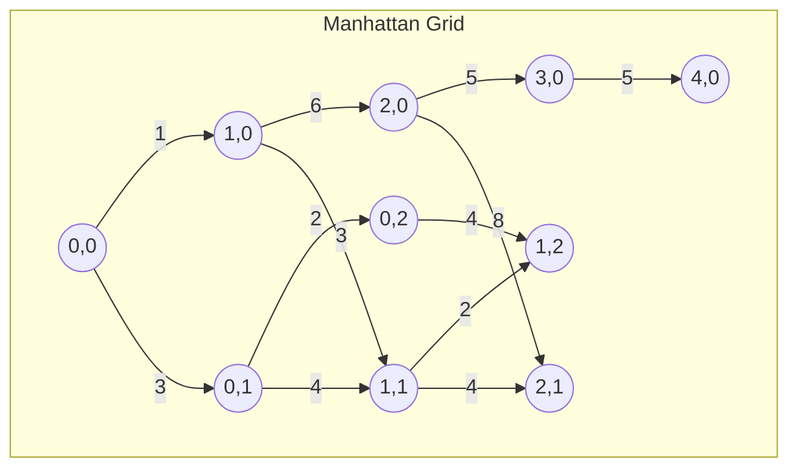
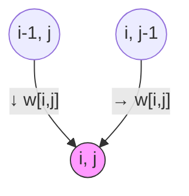

import SummaryBox from '@/components/docs/SummaryBox.astro';


<SummaryBox
  summary="动态规划（Dynamic Programming, DP）是解决优化问题的强大技术。曼哈顿游客问题提供了一个直观的例子，展示了DP的核心思想：通过求解子问题来构建原问题的解。"
  bullets={[
    '理解动态规划的核心思想：分解问题、存储子问题解、避免重复计算',
    '掌握曼哈顿游客问题的递推关系和算法实现',
    '理解DP与序列比对的联系'
  ]}
/>

## 什么是动态规划

动态规划是一种算法设计技术，用于解决具有以下特征的问题：

1. **最优子结构**：问题的最优解包含其子问题的最优解
2. **重叠子问题**：递归算法会反复求解相同的子问题
3. **无后效性**：一旦某个子问题的解确定，它不会受到后续决策的影响

动态规划通过**存储子问题的解**来避免重复计算，从而将指数级复杂度降低到多项式级。

## 曼哈顿游客问题

### 问题描述

想象你在曼哈顿的街道网格中旅行。你只能向南或向东移动。每个城市街区（block）都有一个"吸引力值"（attraction score），表示该街区值得参观的程度。

**问题**：从西南角 (0, 0) 出发，到达东北角 (n, m)，找到一条能访问最多吸引力的路径。

### 问题形式化

给定一个 n×m 的网格：
- 每个垂直边（南北向）有权重 ↓w[i,j]
- 每个水平边（东西向）有权重 →w[i,j]
- 游客从 (0, 0) 出发，只能向南或向东移动
- 目标：找到从 (0, 0) 到 (n, m) 的路径，使路径上边的权重之和最大

### 示例

考虑以下 4×4 的网格（简化自 4×5），其中数字表示边的权重：



*(图中仅展示部分边作为示例)*

## 动态规划解法

### 核心思想

不是直接求解从 (0, 0) 到 (n, m) 的最长路径，而是求解一个**更一般的问题**：

**找到从 (0, 0) 到任意位置 (i, j) 的最长路径**，记为 s[i,j]。

虽然这看起来像是要解决 n×m 个问题而不是 1 个，但求解这些子问题反而更容易，因为它们可以递推地解决。

### 递推关系

要到达位置 (i, j)，游客只有两种方式：

1. 从 (i-1, j) 向南移动
2. 从 (i, j-1) 向东移动



因此，最优路径的长度为：

```
s[i,j] = max(
    s[i-1,j] + ↓w[i,j],    // 从上方到达
    s[i,j-1] + →w[i,j]     // 从左侧到达
)
```

### 边界条件

```
s[0,0] = 0
s[i,0] = s[i-1,0] + ↓w[i,0]  // 只能向南移动
s[0,j] = s[0,j-1] + →w[0,j]  // 只能向东移动
```

### 算法实现

```
MANHATTANTOURIST(↓w, →w, n, m)
1 s[0,0] ← 0
2 for i ← 1 to n
3   s[i,0] ← s[i-1,0] + ↓w[i,0]
4 for j ← 1 to m
5   s[0,j] ← s[0,j-1] + →w[0,j]
6 for i ← 1 to n
7   for j ← 1 to m
8     s[i,j] ← max(s[i-1,j] + ↓w[i,j], s[i,j-1] + →w[i,j])
9 return s[n,m]
```

### 示例计算

使用上面的示例网格，逐步填充 DP 表：

**初始化边界**：
```
s[0,0] = 0
s[1,0] = 0 + 1 = 1
s[2,0] = 1 + 6 = 7
s[3,0] = 7 + 5 = 12
s[4,0] = 12 + 5 = 17

s[0,1] = 0 + 3 = 3
s[0,2] = 3 + 2 = 5
s[0,3] = 5 + 4 = 9
s[0,4] = 9 + 0 = 9
```

**填充内部**：
```
s[1,1] = max(s[0,1] + 4, s[1,0] + 3) = max(3+4, 1+3) = 7
s[1,2] = max(s[0,2] + 4, s[1,1] + 2) = max(5+4, 7+2) = 9
s[1,3] = max(s[0,3] + 5, s[1,2] + 4) = max(9+5, 9+4) = 14
s[1,4] = max(s[0,4] + 0, s[1,3] + 2) = max(9+0, 14+2) = 16

... 继续填充整个表 ...
```

完整的 DP 表：
```
    j=0  j=1  j=2  j=3  j=4
i=0  0    3    5    9    9
i=1  1    7    9   14   16
i=2  7   11   14   20   22
i=3 12   15   18   22   24
i=4 17   20   24   25   34
```

**答案**：s[4,4] = 34，这是从 (0,0) 到 (4,4) 的最长路径权重。

## 为什么这很重要

### 与序列比对的联系

曼哈顿游客问题与**序列比对**问题有着惊人的相似性：

- 网格的南向移动 → 序列比对中的"删除"（gap）
- 网格的东向移动 → 序列比对中的"插入"（gap）
- 如果允许对角线移动 → 序列比对中的"匹配/错配"

事实上，经典的 Needleman-Wunsch 全局比对算法就是曼哈顿游客问题的变体，只是：
1. 允许对角线移动（表示匹配或错配）
2. 边的权重对应匹配、错配、gap的罚分

### 动态规划的关键洞察

1. **求解更一般的问题**：通过求解所有子问题来简化原问题
2. **递推关系**：找到子问题之间的依赖关系
3. **表格填充**：按照正确的顺序填充DP表
4. **空间优化**：有时可以减少空间复杂度（如Hirschberg算法）

## 复杂度分析

- **时间复杂度**：O(n×m)，需要填充整个DP表
- **空间复杂度**：O(n×m)，需要存储整个DP表

对于序列比对问题，如果两个序列长度分别为 n 和 m，则复杂度为 O(n×m)。

## 扩展：恢复最优路径

上面的算法只返回了最优路径的权重，但没有返回路径本身。要恢复路径，需要在填充DP表时记录"决策"（从哪个方向来的）：

```
BACKTRACK(s, n, m)
1 i ← n, j ← m
2 path ← []
3 while i > 0 or j > 0
4   if i > 0 and s[i,j] == s[i-1,j] + ↓w[i,j]
5     path ← append("south", path)
6     i ← i - 1
7   else if j > 0 and s[i,j] == s[i,j-1] + →w[i,j]
8     path ← append("east", path)
9     j ← j - 1
10 return path
```

## 另一个经典例子：找零问题

除了网格类问题，动态规划也适用于一维的优化问题。找零问题（Change Problem）展示了 DP 如何优化递归解法。

### 问题描述

给定金额 M 和硬币面额 c = (c₁, c₂, ..., cₐ)，用最少数量的硬币凑出金额 M。

### 朴素递归解法的问题

```text
RECURSIVECHANGE(M, c, d)
1  if M = 0
2      return 0
3  bestNumCoins ← ∞
4  for i ← 1 to d
5      if M ≥ cᵢ
6          numCoins ← RECURSIVECHANGE(M − cᵢ, c, d)
7          if numCoins + 1 < bestNumCoins
8              bestNumCoins ← numCoins + 1
9  return bestNumCoins
```

**问题**：大量重复计算。例如，计算 77 美分时，70 美分的最优解会被重复计算 9 次。

### DP 优化

关键观察：求解金额 m 的最优解，只需要知道 m - c₁, m - c₂, ..., m - cₐ 的最优解。

**递推关系**：

```
bestNumCoins[m] = min(
    bestNumCoins[m - c₁] + 1,
    bestNumCoins[m - c₂] + 1,
    ...,
    bestNumCoins[m - cₐ] + 1
)  对于所有 m ≥ cᵢ
```

**自底向上算法**：

```text
DPCHANGE(M, c, d)
1  bestNumCoins[0] ← 0
2  for m ← 1 to M
3      bestNumCoins[m] ← ∞
4      for i ← 1 to d
5          if m ≥ cᵢ
6              if bestNumCoins[m - cᵢ] + 1 < bestNumCoins[m]
7                  bestNumCoins[m] ← bestNumCoins[m - cᵢ] + 1
8  return bestNumCoins[M]
```

**复杂度**：
- 时间：O(M × d)
- 空间：O(M)

### 为什么这个转换有效

1. **反向计算顺序**：从 0 开始递增计算到 M，保证计算 bestNumCoins[m] 时，所有需要的子问题都已解决
2. **避免重复计算**：每个子问题只计算一次
3. **表格存储**：用数组 bestNumCoins[] 存储已计算的解

## 实际应用中的考虑

### 1. 局部比对 vs 全局比对

- **全局比对**（如 Needleman-Wunsch）：强制对齐整个序列
- **局部比对**（如 Smith-Waterman）：寻找最佳局部相似区域
- **半全局比对**：允许一端或两端有 gap

### 2. 仿射空隙罚分

实际应用中，连续的 gap 通常使用仿射罚分：
- 开启 gap 的代价：α
- 延长 gap 的代价：β
- k 个连续 gap 的总代价：α + k×β

### 3. 评分矩阵

对于蛋白质比对，使用专门的评分矩阵（如 BLOSUM、PAM）来反映氨基酸替换的生物学倾向性。

## 总结

曼哈顿游客问题是一个经典的动态规划教学案例：

1. **展示了 DP 的核心思想**：分解问题、存储子问题、递推求解
2. **提供了直观的可视化**：网格路径 vs DP 表填充
3. **与实际应用紧密相关**：序列比对算法的数学基础
4. **说明了权衡**：时间 vs 空间的优化可能性

理解曼哈顿游客问题是掌握序列比对、基因预测等生物信息学核心算法的第一步。

## 相关页面

- [Needleman-Wunsch 全局比对](/docs/alignment/needleman-wunsch)
- [Smith-Waterman 局部比对](/docs/alignment/smith-waterman)
- [编辑距离](/docs/alignment/edit-distance)
- [仿射空隙罚分](/docs/alignment/gotoh)
- [空间高效比对（Hirschberg）](/docs/alignment/hirschberg)
