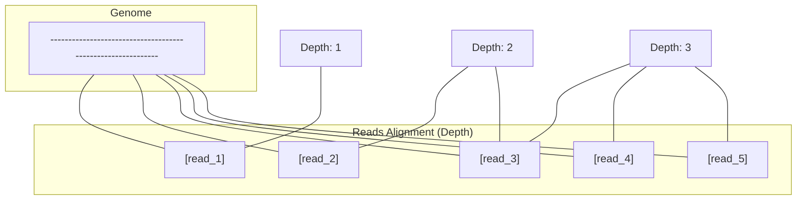
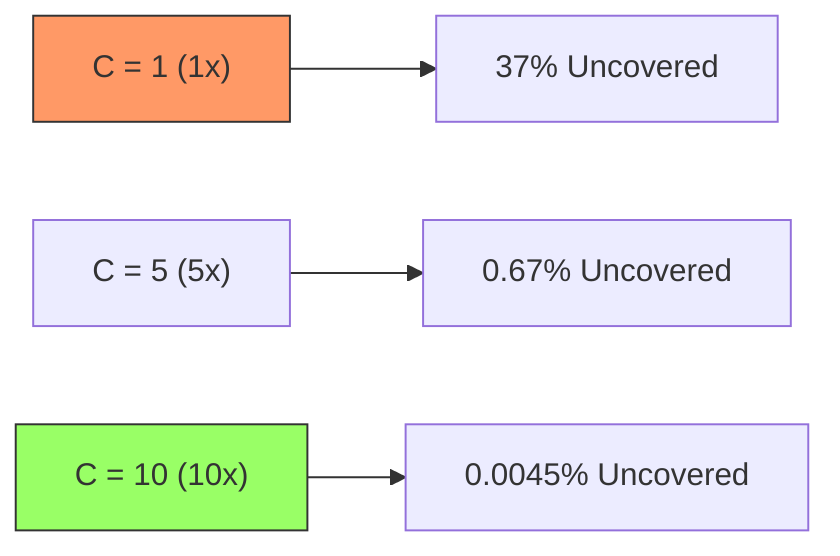

import SummaryBox from '@/components/docs/SummaryBox.astro';
import DefinitionList from '@/components/docs/DefinitionList.astro';
import RelatedLinks from '@/components/docs/RelatedLinks.astro';
import PrerequisitesBox from '@/components/docs/PrerequisitesBox.astro';

<SummaryBox
  summary="在生物信息学中，我们处理的不是完整的基因组，而是由测序仪随机产生的碎片化读段（Reads）。覆盖度（Coverage）不仅是数据量的衡量指标，更是后续统计推断（如变异检测、组装）的信心来源。"
  bullets={[
    '掌握 Reads 的基本属性：长度、质量值（Phred Score）与方向',
    '理解覆盖度（Coverage）与深度（Depth）的数学定义',
    '理解 Lander-Waterman 公式：预测基因组覆盖盲区的直觉',
    '认识测序错误模型（错配、Indel、偏好性）对算法的影响'
  ]}
/>

<PrerequisitesBox
  items={[
    { name: '生物学基础对象', href: '/wiki-bioinfo/foundations/biology-basics' },
    { name: '序列与字符串', href: '/wiki-bioinfo/foundations/sequences-and-strings' }
  ]}
/>

## 1. Reads：基因组的局部观测

测序仪通过物理或化学手段将长 DNA 分子打断并读取出的短片段称为 **Reads**。
- **短读长 (Short Reads)**：通常 100-300 bp，准确率高（~99.9%）。
- **长读长 (Long Reads)**：可达数万 bp，但错误率较高（5-15%）。

## 2. 覆盖度 (Coverage) 与深度 (Depth)

这两个词在实践中常混用，但有细微差别：
- **深度 (Depth)**：指的是基因组上某个特定碱基被多少条 Reads 覆盖。
- **覆盖度 (Coverage)**：通常指整个基因组平均被覆盖的次数。

### 计算公式
$$C = \frac{N \cdot L}{G}$$
- $N$：总 Reads 数量。
- $L$：平均 Read 长度。
- $G$：基因组的总长度。

## 3. Lander-Waterman 公式：预测“未见”

即便平均覆盖度 $C = 10 \times$，基因组中仍然会有一些区域由于随机性而没有被任何 Read 覆盖。

**Lander-Waterman 统计模型**告诉我们：

- **覆盖盲区的比例**：$P(\text{uncovered}) = e^{-C}$。
- **直觉**：如果 $C=1$（1倍覆盖），大约有 $37\%$ 的基因组仍然是未知的。要达到几乎完全覆盖（如 99%），平均深度通常需要提高到 5-10 倍以上。

## 4. 测序错误模型

Reads 并不是真实序列的完美复制：
1.  **错配 (Mismatch)**：最常见的错误，特别是在短读长测序中。
2.  **Indel 错误**：在长读长（如 Nanopore）中常见，容易产生假性的插入或缺失。
3.  **GC 偏好性**：极高或极低 GC 含量的区域往往难以被测序仪均匀覆盖。

**算法对策**：
- 在变异检测中，我们需要利用 **Phred 质量值 ($Q = -10 \log_{10} P_{error}$)** 来过滤低信度的差异。
- 在组装中，我们利用多次覆盖产生的“共识” (Consensus) 来校正单条 Read 的错误。

## 相关页面

<RelatedLinks
  links={[
    { title: '基因组组装', to: '/wiki-bioinfo/assembly', description: '如何将 Reads 拼回基因组' },
    { title: '变异检测总览', to: '/wiki-bioinfo/variants/variant-calling-overview', description: '区分错误与真实变异' },
    { title: '比对质量与多重比对', to: '/wiki-bioinfo/alignment/mapping-quality-and-multi-mapping', description: '衡量比对的可信度' }
  ]}
/>
