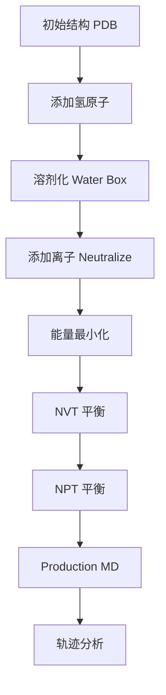

import SummaryBox from '@/components/docs/SummaryBox.astro';
import PrerequisitesBox from '@/components/docs/PrerequisitesBox.astro';
import PitfallsBox from '@/components/docs/PitfallsBox.astro';
import RelatedLinks from '@/components/docs/RelatedLinks.astro';
import ToolMappingBox from '@/components/docs/ToolMappingBox.astro';
import PageHeaderMeta from '@/components/docs/PageHeaderMeta.astro';

<SummaryBox
  summary="分子动力学（Molecular Dynamics, MD）模拟通过数值积分牛顿运动方程，追踪蛋白质等生物大分子在原子级别的运动轨迹。它回答的核心问题是：蛋白质如何在三维空间中运动？构象变化如何影响功能？自由能景观如何决定稳定性？"
  bullets={[
    'MD 模拟基于力场（Force Field）：键合项 + 非键合项（van der Waals + 静电）',
    '通过数值积分 Newton 方程，追踪每个原子的轨迹（位置 + 速度）',
    '时间尺度通常为 ns 到 μs，受计算资源限制',
    '应用：构象变化、配体结合、蛋白质折叠、自由能计算',
    '局限性：时间尺度限制、力场精度、采样不充分',
  ]}
/>

<PageHeaderMeta section="Applications" />

## 是什么

**分子动力学（Molecular Dynamics, MD）** 是一种计算方法，通过模拟原子级别的运动来研究生物大分子的结构动态性和功能机制。

### 核心思想

蛋白质的静态结构（如 PDB 文件）只展示了一个瞬间的快照。真实的蛋白质是**动态分子**，不断经历：

- 局部振动（键长、键角振荡）
- 侧链旋转（χ 角变化）
- loop 区域运动
- 结构域重排
- 大规模构象变化

MD 模拟通过数值积分运动方程，追踪这些动态过程。

## 为什么重要

MD 模拟提供**静态结构无法获得的信息**：

- **构象变化**：蛋白质如何在不同功能状态之间转换
- **结合机制**：配体/药物如何结合到靶标蛋白
- **稳定性分析**：突变如何影响蛋白质折叠和稳定性
- **自由能景观**：不同构象的相对稳定性和转换能垒
- **时间分辨信息**：动力学过程的时间尺度

**关键认知**：结构决定功能，但**动态也决定功能**。很多生物学过程（如酶催化、信号传导、药物结合）需要理解蛋白质的动态行为，而不是单一静态结构。

<PrerequisitesBox
  items={[
    '理解蛋白质基本结构：氨基酸、侧链、二级结构',
    '了解 Newton 运动方程：F = ma',
    '如果不熟悉蛋白质三维结构，先阅读蛋白结构基础',
  ]}
/>

## 力场（Force Field）

### 什么是力场

力场是 MD 模拟的**物理基础**，定义了原子之间的相互作用势能函数：

$$E_{total} = E_{bonded} + E_{nonbonded}$$

### 键合项（Bonded Terms）

| 项 | 物理意义 | 势能函数 |
|----|---------|---------|
| **键伸缩**（Bond stretching） | 化学键长度变化 | 谐振子：$E = \frac{1}{2} k_b (r - r_0)^2$ |
| **键角弯曲**（Angle bending） | 键角变化 | 谐振子：$E = \frac{1}{2} k_\theta (\theta - \theta_0)^2$ |
| **二面角扭转**（Dihedral torsion） | 旋转势垒 | 周期函数：$E = k_\phi [1 + \cos(n\phi - \delta)]$ |

### 非键合项（Nonbonded Terms）

| 项 | 物理意义 | 势能函数 |
|----|---------|---------|
| **van der Waals** | 短程排斥 + 长程吸引 | Lennard-Jones：$E = 4\epsilon [(\sigma/r)^{12} - (\sigma/r)^6]$ |
| **静电相互作用** | 电荷间库仑力 | Coulomb：$E = \frac{q_i q_j}{4\pi\epsilon_0 r}$ |

### 常用力场

| 力场 | 适用范围 | 开发者 |
|------|---------|--------|
| **AMBER** | 蛋白质、核酸 | UCSF |
| **CHARMM** | 蛋白质、脂质、多糖 | Harvard |
| **OPLS** | 蛋白质、有机小分子 | Yale |
| **GROMOS** | 生物分子 | ETH Zurich |

## MD 模拟流程

### 标准流程

### 关键步骤

| 步骤 | 目的 | 典型参数 |
|------|------|---------|
| **能量最小化** | 消除结构冲突和不良接触 | 最速下降法 + 共轭梯度 |
| **NVT 平衡** | 稳定温度（恒定粒子数、体积、温度） | 100 ps，温度耦合 |
| **NPT 平衡** | 稳定密度和压力（恒定粒子数、压力、温度） | 100 ps，压力耦合 |
| **Production** | 生成分析用的轨迹 | 10 ns - 1 μs+ |

### 积分算法

通过数值积分 Newton 方程更新原子位置：

$$F_i = m_i a_i = -\nabla_i E$$

常用算法：
- **Verlet 算法**：$r(t+\Delta t) = 2r(t) - r(t-\Delta t) + a(t)\Delta t^2$
- **Leap-frog 算法**：速度和位置交替更新

**时间步长**（timestep）通常为 2 fs，受最快振动模式（通常是 H 原子键伸缩）限制。

## 轨迹分析

MD 模拟生成的**轨迹**（trajectory）包含每个时间步所有原子的位置和速度。常用分析包括：

### 1. RMSD（Root Mean Square Deviation）

衡量结构偏离初始构象的程度：

$$RMSD(t) = \sqrt{\frac{1}{N} \sum_{i=1}^{N} |\mathbf{r}_i(t) - \mathbf{r}_i(0)|^2}$$

- **低 RMSD**：结构稳定
- **高 RMSD**：结构发生显著变化
- **平台期**：系统达到平衡

### 2. RMSF（Root Mean Square Fluctuation）

衡量每个残基的柔性：

$$RMSF_i = \sqrt{\frac{1}{T} \sum_{t=1}^{T} |\mathbf{r}_i(t) - \langle\mathbf{r}_i\rangle|^2}$$

- **高 RMSF**：柔性区域（如 loop）
- **低 RMSF**：刚性区域（如 α-helix）

### 3. 氢键分析

- 氢键数量随时间变化
- 特定氢键的存在/断裂
- 氢键网络分析

### 4. 主成分分析（PCA）

识别主导运动模式：

- 第一主成分（PC1）：最大方差方向的运动
- 第二主成分（PC2）：次大方差方向的运动
- 投影到 PC1-PC2 空间：构象空间采样

## 应用场景

### 1. 蛋白质折叠

模拟蛋白质从无序到有序的折叠过程，验证折叠机制。

### 2. 配体结合

研究药物分子如何结合到靶标蛋白，结合亲和力，以及结合/解离路径。

### 3. 突变效应

模拟突变如何影响蛋白质稳定性、构象变化或配体结合。

### 4. 自由能计算

通过热力学积分（TI）或自由能微扰（FEP）计算结合自由能。

## 与真实工具或流程的连接

<ToolMappingBox
  items={[
    'MD 引擎：GROMACS、AMBER、NAMD、OpenMM 执行原子级别模拟',
    '轨迹分析：MDTraj、PyEMMA、cpptraj 分析 RMSD、RMSF、氢键',
    '可视化：VMD、PyMOL、ChimeraX 可视化轨迹快照',
    '增强采样：Metadynamics、Replica Exchange 改善采样效率',
  ]}
/>

## 局限性与挑战

<PitfallsBox
  items={[
    '**时间尺度限制**：典型 MD 模拟为 ns-μs，但很多生物学过程（如蛋白质折叠）需要 ms-s。',
    '**力场精度**：力场是近似模型，某些相互作用（如 π-π stacking、cation-π）可能不准确。',
    '**采样不充分**：构象空间巨大，短时间模拟可能只探索局部区域。',
    '**初始结构偏差**：模拟结果可能依赖于起始构象，特别是短时间模拟。',
    '**计算成本高**：全原子模拟需要大量 CPU/GPU 资源，限制了体系大小和时间尺度。',
  ]}
/>

## 本章小结

- MD 模拟通过数值积分 Newton 方程，追踪蛋白质原子级别的运动
- 力场定义原子间相互作用：键合项 + 非键合项
- 标准流程：能量最小化 → 平衡 → Production → 分析
- 轨迹分析提取 RMSD、RMSF、氢键、主成分等动态信息
- 局限性：时间尺度、力场精度、采样充分性

## 相关页面

<RelatedLinks
  links={[
    {
      title: '蛋白结构基础',
      to: '/wiki-bioinfo/structure-bioinfo/protein-structure-basics',
      label: '结构基础',
      description: '理解蛋白质的层次结构和稳定性来源。',
    },
    {
      title: 'AlphaFold 与结构预测',
      to: '/wiki-bioinfo/structure-bioinfo/alphafold-and-structure-prediction',
      label: '静态结构',
      description: '预测静态三维结构，MD 模拟其动态行为。',
    },
    {
      title: '蛋白质互作预测',
      to: '/wiki-bioinfo/structure-bioinfo/protein-interaction-prediction',
      label: '应用层',
      description: 'MD 模拟蛋白质复合体的结合和解离过程。',
    },
  ]}
/>
