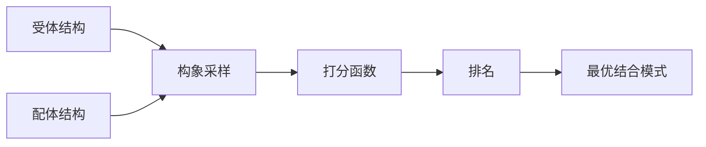

import SummaryBox from '@/components/docs/SummaryBox.astro';
import PrerequisitesBox from '@/components/docs/PrerequisitesBox.astro';
import PitfallsBox from '@/components/docs/PitfallsBox.astro';
import RelatedLinks from '@/components/docs/RelatedLinks.astro';
import ToolMappingBox from '@/components/docs/ToolMappingBox.astro';
import ComparisonTable from '@/components/docs/ComparisonTable.astro';

<SummaryBox
  summary="蛋白质-蛋白质相互作用（Protein-Protein Interaction, PPI）是细胞信号传导、代谢调控和免疫反应的核心。计算方法通过分子对接（docking）、界面预测和网络推断，从不同角度预测和理解 PPI。"
  bullets={[
    '分子对接（docking）：预测两个蛋白质如何结合形成复合体',
    '界面预测：识别蛋白质表面可能参与结合的关键残基',
    '网络推断：从组学数据大规模预测 PPI 网络',
    '结合亲和力评估：量化相互作用强度',
    '实验验证：酵母双杂交、Co-IP、SPR 提供实验证据',
  ]}
/>

## 是什么

**蛋白质-蛋白质相互作用（PPI）** 是两个或多个蛋白质通过物理接触形成的功能性复合体。计算方法从不同层次预测 PPI：

| 层次 | 方法 | 分辨率 | 典型应用 |
|------|------|--------|---------|
| **原子级别** | 分子对接（docking） | Å 级别 | 复合体结构预测、药物设计 |
| **残基级别** | 界面预测 | 残基级别 | 关键结合残基识别 |
| **网络级别** | PPI 网络推断 | 系统级别 | 信号通路、疾病机制 |

## 为什么重要

PPI 在生物学中无处不在：

- **信号传导**：受体-配体结合、激酶级联反应
- **免疫反应**：抗体-抗原识别、MHC-肽呈递
- **转录调控**：转录因子复合体、co-activator 招募
- **代谢途径**：酶复合体、代谢通道
- **疾病机制**：致病变异如何破坏 PPI

**关键认知**：理解 PPI 不仅要知道"谁和谁结合"，还要知道"如何结合"（界面、亲和力、动力学）和"结合后做什么"（功能后果）。

<PrerequisitesBox
  items={[
    '理解蛋白质基本结构：氨基酸、侧链、表面特征',
    '了解非共价相互作用：氢键、疏水作用、静电作用',
    '如果不熟悉蛋白质三维结构，先阅读蛋白结构基础',
  ]}
/>

## 分子对接（Docking）

### 问题定义

**对接问题**：给定两个蛋白质的三维结构（受体和配体），预测它们如何结合形成复合体。

$$\text{输入：结构 A + 结构 B} \rightarrow \text{输出：复合体 A:B}$$

### 对接流程

### 1. 构象采样（Sampling）

探索配体相对于受体的可能结合位姿（pose）：

| 方法 | 原理 | 适用场景 |
|------|------|---------|
| **刚体对接** | 两个蛋白质保持刚性，只平移/旋转 | 已知结构变化小 |
| **半柔性对接** | 配体柔性，受体刚性 | 常见策略 |
| **柔性对接** | 两者都允许构象变化 | 计算成本高，更真实 |

**搜索空间**：6 维（3 个平移 + 3 个旋转），加上内部自由度。

### 2. 打分函数（Scoring）

评估每个位姿的结合亲和力：

| 类型 | 原理 | 优缺点 |
|------|------|--------|
| **力场打分** | 基于物理势能（van der Waals + 静电） | 物理基础强，但计算慢 |
| **经验打分** | 拟合已知复合体数据 | 快速，但可能过拟合 |
| **知识打分** | 基于统计势（ observed frequencies） | 捕捉统计规律 |

### 常用对接工具

| 工具 | 特点 | 适用场景 |
|------|------|---------|
| **HADDOCK** | 整合实验约束（NMR、mutagenesis） | 高精度复合体建模 |
| **ClusPro** | 快速刚体对接 + 聚类 | 大规模筛选 |
| **ZDOCK** | FFT 加速搜索 | 蛋白质-蛋白质对接 |
| **AutoDock** | 主要配体-受体对接 | 药物设计 |

## 界面预测

### 结合界面特征

蛋白质-蛋白质结合界面通常具有以下特征：

| 特征 | 说明 |
|------|------|
| **疏水残基富集** | 疏水作用驱动结合 |
| **进化保守** | 界面残基在同源蛋白中保守 |
| **平面或凹陷** | 几何互补性 |
| **带电残基环** | 静电作用稳定结合 |
| **热点残基（Hot Spots）** | 少数残基贡献大部分结合能 |

### 预测方法

| 方法 | 原理 | 工具示例 |
|------|------|---------|
| **基于结构** | 表面可及性、几何特征 | PIER、Promap |
| **基于进化** | 保守性分析 | ConSurf |
| **基于机器学习** | 训练分类器 | SPPIDER、PSIVER |
| **基于能量** | 计算残基结合能贡献 | Robetta Alanine Scanning |

## PPI 网络推断

### 从分子到系统

除了原子级别的对接，PPI 研究还在**网络级别**展开：

| 问题 | 方法 | 数据来源 |
|------|------|---------|
| **蛋白质 A 和 B 是否互作？** | 网络推断 | 酵母双杂交、质谱、共表达 |
| **A 通过哪些中间蛋白影响 C？** | 路径搜索 | STRING、BioGRID |
| **哪些蛋白是关键枢纽（hub）？** | 网络分析 | 度中心性、介数中心性 |

### 实验方法

| 方法 | 原理 | 规模 |
|------|------|------|
| **酵母双杂交（Y2H）** | 转录因子重建检测互作 | 中等规模 |
| **亲和纯化-质谱（AP-MS）** | 共纯化检测复合体 | 大规模 |
| **表面等离子共振（SPR）** | 实时检测结合动力学 | 小规模，高精度 |
| **Co-IP** | 免疫共沉淀 | 验证性实验 |

### 数据库资源

| 数据库 | 内容 | 规模 |
|--------|------|------|
| **STRING** | 预测和实验 PPI 网络 | > 10 亿互作 |
| **BioGRID** | 实验验证 PPI | > 100 万互作 |
| **IntAct** | 分子互作数据库 | 实验验证 |
| **DIP** | 互作数据库 |  curated 数据 |

## 结合亲和力评估

### 关键指标

| 指标 | 定义 | 典型范围 |
|------|------|---------|
| **Kd（解离常数）** | 平衡时解离/结合速率比 | nM - μM |
| **ΔG（结合自由能）** | 结合过程自由能变化 | -5 到 -15 kcal/mol |
| **IC50** | 50% 抑制浓度 | 药物筛选常用 |

### 计算估计

| 方法 | 精度 | 计算成本 |
|------|------|---------|
| **MM-PBSA/GBSA** | 中等 | 中等 |
| **自由能微扰（FEP）** | 高 | 很高 |
| **打分函数** | 低-中 | 低 |

## 与真实工具或流程的连接

<ToolMappingBox
  items={[
    '对接工具：HADDOCK、ClusPro、ZDOCK 预测复合体结构',
    '界面预测：PSIVER、SPPIDER 识别关键结合残基',
    '网络分析：Cytoscape 可视化和分析 PPI 网络',
    '数据库查询：STRING 获取已知和预测的 PPI 信息',
    '实验验证：SPR 测量结合动力学，Y2H 筛选互作伙伴',
  ]}
/>

## 常见概念误区

<PitfallsBox
  items={[
    '**对接 = 绝对真理**：对接结果是预测，需要实验验证。打分函数经常给出错误排名。',
    '**静态结构足够**：很多 PPI 涉及构象变化，刚性对接可能失败。',
    '**PPI 网络 = 物理接触**：网络中的边可能是间接关系（如共表达），不一定是直接物理互作。',
    '**界面残基都同等重要**：热点残基贡献大部分结合能，突变影响远大于其他界面残基。',
    '**Kd 越低越好**：过强的结合可能不利于动态调控，生理条件需要适当的亲和力。',
  ]}
/>

## 本章小结

- PPI 预测从三个层次展开：原子级别（对接）、残基级别（界面）、网络级别
- 分子对接通过构象采样和打分预测复合体结构
- 界面识别关键结合残基，特别是热点残基
- PPI 网络推断揭示系统级别的互作关系
- 计算预测需要实验验证（Y2H、SPR、Co-IP）

## 相关页面

<RelatedLinks
  links={[
    {
      title: '蛋白结构基础',
      to: '/docs/structure-bioinfo/protein-structure-basics',
      label: '结构基础',
      description: '理解蛋白质三维结构是对接的前提。',
    },
    {
      title: '分子动力学基础',
      to: '/docs/structure-bioinfo/molecular-dynamics-basics',
      label: '动态模拟',
      description: 'MD 模拟复合体的结合和解离过程。',
    },
    {
      title: 'UniProt 蛋白质数据库',
      to: '/docs/databases/uniprot',
      label: '功能注释',
      description: '蛋白质功能域和互作相关信息。',
    },
  ]}
/>
